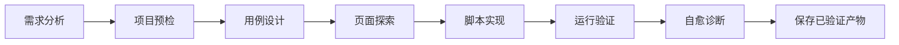
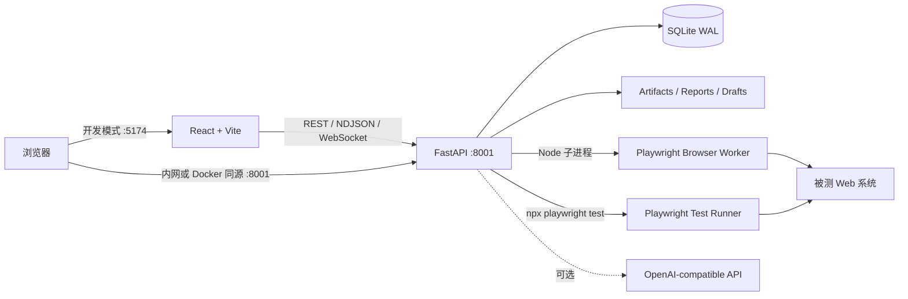

# AI AutoTest - Web 智能测试平台

> 文档更新时间：2026-09-07

AI AutoTest 是一套本地优先的 Web 自动化测试工作台。它以“需求工单”为主线，将需求分析、用例设计、真实浏览器探索、Playwright 脚本生成、运行验证、自愈诊断和报告归档串成可追溯流程。

平台适合新功能冒烟、缺陷修复验证、定向回归、已有 Playwright 资产入库，以及可信内网中的多人协作。前端使用 React + Vite，后端使用 FastAPI + SQLite，浏览器自动化由 Playwright 驱动。

## 核心能力

- **一键自动化**：从需求输入开始，自动推进 8 个测试阶段，并通过 WebSocket 实时输出阶段、步骤和日志。
- **人工工作台**：可在需求、用例、探索、脚本、执行和自愈任一阶段审阅、修正、接管或单步重跑。
- **真实页面探索**：通过 Playwright + CDP Screencast 展示可交互浏览器画面，采集页面结构、截图、日志和候选元素。
- **AI 辅助生成**：支持 OpenAI-compatible Responses API，用于需求分析、用例生成、脚本生成、探索计划、用例助手和全局助手。
- **可审核资产链路**：AI 结果先进入草稿；运行验证通过后，才发布测试用例、脚本和报告。
- **用例与脚本导入**：上传 Markdown 用例表和自包含 Playwright TypeScript spec，预检测试发现、依赖、环境变量和用例 ID 绑定关系。
- **测试执行与自愈**：支持单工单执行、单用例调试、批量调试、测试套件执行、失败诊断和最多 3 轮测试侧自愈。
- **报告与证据**：保存运行日志、截图、脚本版本、Playwright HTML Report、用例报告和工单总结报告。
- **项目级配置**：管理项目、功能树、目标环境、普通变量和加密密钥。
- **账号与权限**：提供管理员、测试负责人、测试执行者和只读访客四种角色。

## 完整 Web 自动化测试流程



`一键自动化` 会自动编排整条链路；`人工工作台` 使用同一份工单和阶段数据，可随时补充需求、修改用例、接管浏览器、调整脚本或单独复跑。

## 产品模块

| 分组 | 模块 | 主要用途 |
| --- | --- | --- |
| 工作台 | 总览、一键自动化 | 查看质量指标，启动完整自动化流程 |
| 人工工作台 | 需求工单、用例设计、探索实验室、脚本工作台、执行测试、自愈诊断 | 分阶段实施、审阅和人工接管 |
| 测试执行 | 测试套件、执行监控 | 组织稳定用例，查看执行进度与历史 |
| 资产管理 | 项目管理、用例管理、测试报告 | 管理项目、正式用例、脚本和报告资产 |
| 系统设置 | 用户管理、AI 配置、功能配置 | 管理账号权限、模型配置和项目功能树 |

## 技术架构



| 层级 | 技术 |
| --- | --- |
| 前端 | React 19、Vite 7、Lucide React、React Markdown |
| 后端 | Python、FastAPI、Uvicorn、Pydantic |
| 数据 | SQLite WAL、Fernet 加密密钥 |
| 自动化 | Playwright 1.60、TypeScript |
| 通信 | REST、NDJSON 流式响应、WebSocket、CDP Screencast |
| 部署 | 原生开发模式、单端口内网模式、Docker Compose、可选 Nginx HTTPS |

## 目录结构

```text
AI-AutoTest/
├── backend/
│   ├── requirements.txt              # Python 依赖
│   └── app/
│       ├── main.py                   # FastAPI 装配、路由注册、SPA 托管
│       ├── platform.py               # 核心业务与自动化流程编排
│       ├── core/                     # 配置、路径、权限、安全、日志
│       ├── routers/                  # REST、WebSocket 和报告路由
│       ├── schemas/                  # API 请求/响应模型
│       ├── repositories/             # 数据访问层
│       ├── services/                 # 业务服务层
│       ├── runtime/                  # 浏览器与 Playwright 运行时
│       ├── migrations/               # 数据库初始化与迁移
│       └── browser_worker.cjs        # 实时浏览器 Worker
├── frontend/
│   ├── src/app/                      # 应用壳、导航和模块装配
│   ├── src/api/                      # API 客户端
│   ├── src/components/               # 通用组件
│   ├── src/hooks/                    # 页面状态与数据 Hooks
│   ├── src/modules/                  # 各业务模块
│   └── src/styles/                   # 全局、布局和模块样式
├── tests/
│   ├── e2e/                          # Playwright 用例、脚本和报告
│   └── test_*.py                     # Python unittest 测试
├── artifacts/automation-platform/    # 运行证据、归档报告、密钥等
├── playwright-report/                # Playwright HTML Report
├── scripts/docker-migrate-state.py   # 原生状态迁移到 Docker 数据目录
├── Dockerfile
├── compose.yml                       # Docker 公共配置
├── compose.lan.yml                   # 可信内网 HTTP 部署
├── compose.https.yml                 # Nginx HTTPS 部署
├── package.json                      # 根目录开发和测试脚本
└── playwright.config.ts
```

## 环境要求

- Node.js `^20.19.0` 或 `>=22.12.0`
- npm（建议使用 Node.js 自带版本）
- Python 3.12（推荐）
- macOS、Linux 或 Windows 开发环境
- 可访问目标系统的网络环境

长期团队部署建议使用 Linux x86_64、Docker Compose v2 和本地 SSD。

## 快速开始

所有命令均在仓库根目录执行。

### 1. 安装依赖

```bash
npm ci
npm --prefix frontend ci

python3 -m venv .venv
.venv/bin/python -m pip install --upgrade pip
.venv/bin/python -m pip install -r backend/requirements.txt

npx playwright install chromium
```

Windows PowerShell 需要将 `.venv/bin/python` 替换为 `.venv\Scripts\python.exe`。

### 2. 初始化管理员

全新数据库首次启动前，设置管理员初始密码：

```bash
export QA_BOOTSTRAP_ADMIN_PASSWORD='请设置至少8位且包含字母和数字的密码'
```

默认管理员账号为 `admin`。如果当前数据库中已经存在管理员，后续启动无需重复设置该变量。

### 3. 启动开发环境

```bash
npm run dev
```

该命令会同时启动：

- 前端：`http://127.0.0.1:5174`
- 后端：`http://127.0.0.1:8001`
- 健康检查：`http://127.0.0.1:8001/api/health`

也可以分别运行 `npm run dev:frontend` 和 `npm run dev:backend`，方便独立观察日志。

### 4. 登录与初始化

1. 使用 `admin` 和初始化密码登录。
2. 在“项目管理”中创建或完善项目、目标 URL 和运行环境。
3. 在“功能配置”中维护项目功能树。
4. 在“AI 配置”中配置模型，或继续使用规则兜底与人工编辑。
5. 从“一键自动化”或“人工工作台 > 需求工单”开始测试。

新注册账号默认为 `viewer` 且状态为待审核，需要管理员在“用户管理”中启用并分配角色。

## 运行方式

### 本地开发

```bash
npm run dev
```

Vite 会把 `/api`、`/reports` 和 `/ws` 代理到 `127.0.0.1:8001`。

### 可信内网单端口运行

```bash
npm run build:lan
QA_MAX_ACTIVE_BROWSER_SESSIONS=10 npm run start:lan
```

FastAPI 会在 `8001` 端口同时提供前端、API、报告和 WebSocket。其他电脑可以访问服务器固定内网地址，例如 `http://192.168.1.50:8001`。

内网模式必须保持单个 Uvicorn worker。浏览器会话、WebSocket、任务队列和自动化流程状态部分保存在进程内，多 worker 会造成状态分裂。

### Docker Compose

```bash
cp .env.docker.example .env.docker
chmod 600 .env.docker

docker compose --env-file .env.docker \
  -f compose.yml \
  -f compose.lan.yml \
  up -d --build
```

Docker 镜像包含前端构建、Python 后端、Node.js、Playwright 和 Chromium。HTTPS、现有数据迁移、备份和升级步骤见 [DOCKER.md](./DOCKER.md)。

## AI 配置

推荐由管理员在“系统设置 > AI 配置”中创建配置、测试连接并切换活动配置。平台也支持通过环境变量注入：

```bash
export OPENAI_API_KEY='your-api-key'
export OPENAI_BASE_URL='https://api.openai.com/v1'
npm run dev:backend
```

- 环境变量优先于页面保存的配置。
- `OPENAI_BASE_URL` 支持兼容 OpenAI Responses API 的代理或私有网关。
- 未配置 AI、模型不可用或输出校验失败时，部分流程会使用规则兜底；必须依赖 AI 的生成或修复能力会明确返回错误。
- 设置 `QA_DISABLE_AI=1` 可在测试环境中禁用 AI 调用。
- API Key 和项目密钥不会通过普通读取接口回显明文。

## 常用环境变量

| 变量 | 用途 | 默认值/说明 |
| --- | --- | --- |
| `QA_BOOTSTRAP_ADMIN_PASSWORD` | 全新数据库创建 `admin` 时的初始密码 | 首次启动必填 |
| `QA_AUTH_DISABLED` | 本地开发或自动化测试跳过鉴权 | `0`；仅建议临时使用 `1` |
| `QA_AUTH_COOKIE_SECURE` | 仅通过 HTTPS 发送登录 Cookie | HTTP 为 `0`，HTTPS 为 `1` |
| `QA_DB_PATH` | SQLite 数据库位置 | `backend/automation-platform.sqlite` |
| `QA_SECRET_KEY` | 直接提供 Fernet 主密钥 | 未设置时读取或生成密钥文件 |
| `QA_SECRET_KEY_PATH` | Fernet 密钥文件位置 | `artifacts/automation-platform/.secret-key` |
| `QA_LOG_LEVEL` | 后端日志级别 | `INFO` |
| `QA_ALLOWED_ORIGINS` | 额外允许的前端 Origin，逗号分隔 | 本地常用端口已内置 |
| `QA_MAX_ACTIVE_BROWSER_SESSIONS` | 活动浏览器并发上限 | 原生默认 `10`；Docker 示例为 `3` |
| `QA_EXPLORATION_PLAN_TIMEOUT_SECONDS` | AI 探索计划超时 | `120` |
| `OPENAI_API_KEY` | OpenAI-compatible API Key | 可选 |
| `OPENAI_BASE_URL` | OpenAI-compatible Base URL | `https://api.openai.com/v1` |

## 数据与安全

- 默认数据库为 `backend/automation-platform.sqlite`，启动时自动初始化，并启用 SQLite WAL 和 5 秒 busy timeout。
- 项目密钥通过 Fernet 加密；备份和恢复时必须让数据库与主密钥属于同一个恢复点。
- 登录使用 HttpOnly Cookie Session，会话默认有效 8 小时。
- 后端日志会遮蔽密码、API Key、Authorization 和 URL 查询参数等常见敏感信息。
- `artifacts/`、`playwright-report/`、`test-results/` 和运行草稿目录都属于需要规划备份与清理策略的运行数据。
- 平台只应访问经过授权的被测系统，不应把可信内网 HTTP 端口直接暴露到公网。

主要运行目录：

| 路径 | 内容 |
| --- | --- |
| `artifacts/automation-platform/` | 浏览器证据、归档报告、导入暂存、流程产物、密钥文件 |
| `artifacts/projects/` | 按项目归档的测试交付物 |
| `tests/e2e/.draft-runs/` | 工单草稿运行脚本 |
| `tests/e2e/.live-runs/` | 实时执行脚本 |
| `tests/e2e/.execution-configs/` | 独立 Playwright 运行配置 |
| `playwright-report/` | 最新 Playwright HTML Report |
| `test-results/` | Playwright 失败证据 |

## 测试与检查

前端构建检查：

```bash
npm --prefix frontend run build
```

后端语法检查：

```bash
.venv/bin/python -m py_compile backend/app/main.py backend/app/platform.py
```

运行 Python 单元测试：

```bash
.venv/bin/python -m unittest discover -s tests -p 'test_*.py'
```

运行指定 Playwright 测试：

```bash
PLATFORM_URL=http://127.0.0.1:5174 \
API_URL=http://127.0.0.1:8001 \
QA_BOOTSTRAP_ADMIN_PASSWORD="$QA_BOOTSTRAP_ADMIN_PASSWORD" \
npx playwright test tests/e2e/automation-platform.spec.ts --project=chromium
```

运行全部 Playwright 测试和查看报告：

```bash
npm run test:e2e
npm run test:e2e:report
```

仓库中的 E2E 脚本覆盖多个目标系统，并非所有脚本都能在任意环境直接运行。执行前请检查目标 URL、账号密钥和网络可达性。测试若创建平台数据，应使用唯一标记，并且只清理本次创建且能明确识别的数据；不要使用全量重置方式清空历史数据。

## API 概览

后端按领域拆分路由，主要包括：

- `/api/auth/*`、`/api/users/*`：登录、注册、账号与权限。
- `/api/projects/*`、`/api/features/*`、`/api/project-environments/*`：项目、功能树和环境变量。
- `/api/work-items/*`：需求工单、用例生成、探索、脚本、运行、自愈和产物保存。
- `/api/automation-flows/*`、`/ws/automation-flows/*`：一键流程与实时事件。
- `/api/test-cases/*`、`/api/test-case-imports/*`：用例资产、Playwright 导入和脚本版本。
- `/api/case-debug-*`：单用例和批量调试会话。
- `/api/test-suites/*`、`/api/suite-runs/*`、`/api/runs/*`：套件与执行记录。
- `/api/deliverables/*`、`/api/*reports*`、`/reports/*`：交付物和可视化报告。
- `/api/ai-config/*`、`/api/global-assistant/*`：AI 配置与全局助手。
- `/ws/browser-sessions/*`：实时浏览器画面和交互控制。
- `/api/health`：服务、AI、数据库、内存和浏览器容量状态。

登录后可通过 FastAPI OpenAPI 页面查看完整接口定义：`http://127.0.0.1:8001/docs`。

## 当前边界

- 主要面向 Web UI 和 Playwright TypeScript 自动化，不是通用移动端或原生桌面测试平台。
- 当前部署模型是单机、单实例、单 Uvicorn worker；SQLite 和进程内任务状态不适合直接横向扩容。
- 服务重启会中断正在运行的浏览器、WebSocket 和测试子进程，但已持久化的数据与报告仍会保留。
- 导入脚本当前要求自包含，只接受 `@playwright/test` 或 `playwright/test`，不接收外部 fixture、Page Object 或第三方运行时依赖。
- 测试套件的计划配置可以保存，但当前不代表后台调度器会自动按时触发执行。
- 探索阶段会自动推荐高置信 selector；正式脚本仍应经过人工审阅和运行验证。

## 常见问题

### 页面提示“后端连接失败”

```bash
curl --noproxy '*' http://127.0.0.1:8001/api/health
```

如果连接失败，检查 `npm run dev:backend` 的启动日志、Python 依赖和 `8001` 端口占用。

### 接口返回 `401 Unauthorized`

重新使用 `admin` 和初始化时设置的密码登录。开发或自动化测试需要临时跳过鉴权时，可以运行：

```bash
QA_AUTH_DISABLED=1 npm run dev
```

不要在共享或生产环境中关闭鉴权。

### Playwright 找不到浏览器

```bash
npx playwright install chromium
```

Linux 服务器还可以根据 Playwright 提示安装系统依赖；Docker 镜像已包含浏览器运行环境。

### localhost 请求受到代理影响

```bash
export NO_PROXY='127.0.0.1,localhost,*'
```

## 相关文档

- [项目使用手册](./docs/Web智能测试平台项目使用手册.md)
- [Docker 部署说明](./DOCKER.md)
- [部署文档](./Web智能测试平台部署文档.md)
- [项目执行约定](./AGENTS.md)
- [测试数据清理约定](./记忆.md)

## License

本项目使用 [MIT License](./LICENSE)。
