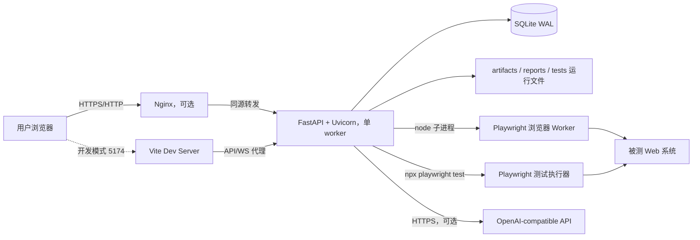
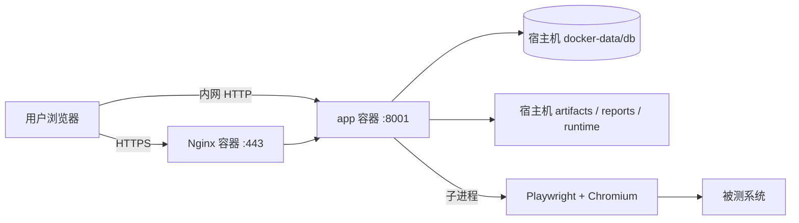

# Web 智能测试平台部署文档

> 文档版本：1.2  
> 分析日期：2026-09-07  
> 适用仓库：`/Users/syj/Documents/AI-AutoTest`  
> 适用范围：开发环境、可信内网单机环境、带 HTTPS 反向代理的团队共享环境

## 1. 文档目的

本文档基于当前仓库代码、依赖清单和启动脚本整理，说明平台的技术架构、代码目录、运行依赖、部署方式、配置项、持久化数据、备份恢复、安全加固、升级回滚和日常运维方法。

当前项目应部署为**单台主机上的单实例服务**，Linux 是团队长期运行的首选，Windows 和 macOS 也可用于办公内网、测试工作站或小团队环境。前端构建后由 FastAPI 同端口托管，FastAPI 同时提供 REST API、WebSocket、NDJSON 流式接口、测试报告和前端静态资源；测试执行和页面探索通过本机 Node.js/Playwright 子进程完成。

## 2. 项目概述

平台面向 Web 自动化测试全流程，主要能力包括：

- 需求工单、用例设计、页面探索、脚本生成、执行验证、自愈诊断和交付报告。
- 项目、功能、测试用例、测试套件、运行记录、用户和 AI 配置管理。
- Playwright 测试发现、执行、HTML Report 生成和测试证据归档。
- WebSocket 实时浏览器画面与交互控制。
- OpenAI-compatible AI 接口接入，以及 AI 不可用时的规则兜底。
- 基于 SQLite 的业务数据持久化，以及基于 Fernet 的敏感运行变量加密。

## 3. 整体技术架构



### 3.1 运行链路

1. 浏览器访问前端页面。
2. 前端通过同源 `/api/*`、`/reports/*` 和 `/ws/*` 访问后端。
3. 后端将业务数据写入 SQLite，将报告、截图、脚本草稿和运行产物写入项目目录。
4. 页面探索时，后端启动 `node backend/app/browser_worker.cjs` 子进程。
5. 测试执行时，后端启动 `npx playwright test` 子进程，并生成独立运行配置和 HTML Report。
6. 配置 AI 后，后端直接调用 OpenAI-compatible Responses API。

### 3.2 当前架构的重要限制

- **必须使用单个 Uvicorn worker。** 浏览器会话、WebSocket 连接、自动化流程任务和容量队列保存在进程内存中，多 worker 会导致状态分裂。
- **SQLite 适合当前单机部署，不适合直接做多节点高可用。** 数据库已启用 WAL、外键和 5 秒 busy timeout。
- **服务重启会中断正在运行的浏览器和测试子进程。** 已保存的数据和报告仍在，但内存中的活动会话不会跨进程恢复。
- **代码目录需要可写。** 除数据库和密钥路径可通过环境变量调整外，`artifacts/`、`playwright-report/`、`tests/e2e/.live-runs/` 等路径均相对于仓库根目录固定生成。
- 当前仓库没有 `Dockerfile`、Compose、Kubernetes、Nginx 或 systemd 成品配置；容器化不是开箱即用的部署方式。

## 4. 技术栈

### 4.1 前端

| 类别 | 技术 | 当前版本/说明 |
| --- | --- | --- |
| UI 框架 | React | `package.json` 声明 `^19.2.3`，锁文件解析为 `19.2.7` |
| 构建工具 | Vite | 声明 `^7.2.7`，锁文件解析为 `7.3.5` |
| Vite 插件 | `@vitejs/plugin-react` | React JSX/Fast Refresh 支持 |
| Markdown | `react-markdown`、`remark-gfm` | 报告和富文本内容渲染 |
| 图标 | `lucide-react` | 工作台图标库 |
| 网络通信 | Fetch、WebSocket、NDJSON | Cookie 鉴权，支持流式生成和实时浏览器画面 |
| 状态持久化 | 浏览器 Local Storage | 主题、当前模块、当前项目等界面状态 |

### 4.2 后端

| 类别 | 技术 | 当前版本/说明 |
| --- | --- | --- |
| Web 框架 | FastAPI | `0.115.6` |
| ASGI 服务 | Uvicorn Standard | `0.34.0` |
| 数据库 | SQLite | Python 标准库 `sqlite3`，WAL 模式 |
| 数据模型 | Pydantic/FastAPI Schema | 位于 `backend/app/schemas/` |
| 文件上传 | `python-multipart` | `0.0.20` |
| 加密 | `cryptography` / Fernet | `45.0.7` |
| 鉴权 | HttpOnly Cookie Session | 会话默认 8 小时，密码使用 PBKDF2-SHA256 |
| 日志 | Python Logging | 输出到 stderr，自动遮蔽常见敏感字段 |

### 4.3 自动化测试运行时

| 类别 | 技术 | 当前版本/说明 |
| --- | --- | --- |
| 浏览器自动化 | Playwright | `1.60.0` |
| 测试运行器 | `@playwright/test` | `1.60.0` |
| 脚本语言 | TypeScript | `5.9.3` |
| 浏览器 | Chromium | 页面探索、实时执行和 E2E 测试 |
| 子进程调用 | Node.js、`npx` | FastAPI 运行用户的 `PATH` 中必须可用 |

### 4.4 推荐运行版本

- Linux：Ubuntu Server 22.04/24.04 或兼容的 x86_64 Linux，适合正式部署。
- Windows：64 位桌面版或 Server 版，适合办公内网和 Windows 测试工作站。
- macOS：Apple Silicon 或 Intel Mac，适合开发、演示和小团队部署。
- Python：推荐 `3.12.x`；当前分析环境为 `3.12.13`。
- Node.js：必须满足 Vite 的 `^20.19.0 || >=22.12.0`；生产建议使用 Node.js 22 或 24 的稳定版本。
- npm：使用 Node.js 配套版本，并通过 `npm ci` 按锁文件安装。
- SQLite CLI：用于一致性备份、检查和恢复。

## 5. 项目代码目录结构

```text
AI-AutoTest/
├── backend/
│   ├── requirements.txt                 # Python 依赖
│   ├── automation-platform.sqlite       # 默认业务数据库，运行时生成
│   └── app/
│       ├── main.py                      # FastAPI 应用装配、路由注册、SPA 托管
│       ├── platform.py                  # 当前核心业务实现和运行编排
│       ├── core/                        # 配置、路径、权限、安全、日志、时间工具
│       ├── routers/                     # REST API、WebSocket、报告路由
│       ├── schemas/                     # API 请求/响应模型
│       ├── repositories/                # 数据访问层
│       ├── services/                    # 领域服务层
│       ├── runtime/                     # Playwright 与浏览器运行时兼容入口
│       ├── reports/                     # Markdown/报告路径处理
│       ├── migrations/                  # 数据库初始化兼容入口
│       ├── browser_worker.cjs           # 实时浏览器 Worker
│       ├── page_readiness.cjs           # 页面稳定性与可操作性判断
│       ├── url_parameterizer.cjs        # 测试 URL 参数化
│       ├── playwright_dependency_analyzer.cjs
│       ├── playwright_imports.py        # Playwright 导入发现与依赖校验
│       └── secret_store.py              # Fernet 密钥加载和敏感变量加解密
├── frontend/
│   ├── index.html                       # Vite HTML 入口
│   ├── package.json                     # 前端依赖和构建脚本
│   ├── vite.config.js                   # 开发代理配置
│   └── src/
│       ├── main.jsx                     # React 入口
│       ├── app/                         # App Shell、权限和导航骨架
│       ├── api/                         # API 客户端
│       ├── components/                  # 通用、鉴权和布局组件
│       ├── hooks/                       # 各领域状态和请求 Hook
│       ├── modules/                     # 业务功能模块
│       ├── assets/                      # 前端静态资源
│       ├── styles/                      # 基础、布局和模块样式
│       └── utils/                       # 日期、状态、报告、WebSocket 等工具
├── tests/
│   ├── test_*.py                        # 后端单元/集成测试
│   └── e2e/
│       ├── *.spec.ts                    # Playwright E2E 和业务脚本
│       ├── *-test-cases.md              # 测试用例文档
│       ├── .live-runs/                  # 运行时临时脚本
│       ├── .draft-runs/                 # 工单草稿脚本
│       └── .execution-configs/          # 每次执行生成的 Playwright 配置和结果
├── artifacts/
│   ├── automation-platform/             # 流程、报告、截图、导入暂存、密钥等
│   └── projects/                        # 项目级交付产物
├── playwright-report/                   # 最新 Playwright HTML Report
├── reports/                             # 人工或专项报告
├── screenshots/                         # 验收截图
├── package.json                         # 根级 Playwright 和启动脚本
├── playwright.config.ts                 # 仓库级 Playwright 配置
├── README.md                            # 项目说明
├── 记忆.md                              # 测试及数据清理约定
└── Web智能测试平台部署文档.md           # 本文档
```

说明：前后端已开始按模块拆分，但核心后端逻辑仍主要集中在 `backend/app/platform.py`，前端主编排仍主要集中在 `frontend/src/app/App.jsx`。部署时应以实际入口文件和根级脚本为准。

## 6. 端口与网络

| 场景 | 监听地址 | 默认端口 | 说明 |
| --- | --- | --- | --- |
| 前端开发 | `127.0.0.1` | `5174` | Vite Dev Server |
| 后端开发 | `127.0.0.1` | `8001` | Uvicorn，Vite 将 API/WS 代理到此端口 |
| 内网单机 | `0.0.0.0` | `8001` | FastAPI 同时托管前端、API、WS 和报告 |
| HTTPS 团队部署 | `127.0.0.1` | `8001` | 仅供本机 Nginx 反向代理 |
| 外部访问 | 主机网卡 | `443` | 推荐只暴露 HTTPS |

平台需要从服务器主动访问：

- 被测 Web 系统的 HTTP/HTTPS 地址。
- npm/PyPI 和 Playwright 浏览器下载源，仅首次安装或升级时需要。
- 配置的 OpenAI-compatible API 地址，未启用 AI 时不需要。

## 7. 持久化数据与权限

### 7.1 需要持久化和备份的内容

| 路径 | 重要性 | 内容 |
| --- | --- | --- |
| `backend/automation-platform.sqlite` 或 `QA_DB_PATH` | 必须 | 用户、项目、用例、运行记录、配置、审计等业务数据 |
| `artifacts/automation-platform/.secret-key` 或 `QA_SECRET_KEY_PATH` | 必须 | Fernet 主密钥；丢失后已加密变量无法解密 |
| `artifacts/automation-platform/` | 必须 | 流程运行、浏览器预览、导入暂存、历史 Playwright 报告等 |
| `artifacts/projects/` | 必须 | 项目级测试用例、脚本和交付报告 |
| `tests/e2e/.draft-runs/` | 建议 | 工单草稿脚本 |
| `tests/e2e/.live-runs/` | 可选 | 执行时生成的临时脚本，通常可重新生成 |
| `tests/e2e/.execution-configs/` | 建议 | 单次执行配置、JSON 结果等 |
| `playwright-report/` | 建议 | 最新报告入口 |
| 配置项目指向的外部仓库 | 按需 | 平台可能读取或写入其测试目录和交付路径 |

分析时，当前仓库的 `artifacts/` 约为 1.4 GB，默认 SQLite 数据库约为 38 MB。该数值只代表 2026-09-07 的开发数据快照，生产容量应按截图、视频、trace 和报告保留周期单独规划。

### 7.2 文件权限

运行 Uvicorn 的系统用户至少需要：

- 读取整个仓库、Node.js 依赖、Python 虚拟环境和 Playwright 浏览器文件。
- 写入 `backend/` 中的默认数据库位置，或写入 `QA_DB_PATH` 指定目录。
- 写入 `artifacts/`、`playwright-report/`、`test-results/` 和 `tests/e2e/` 下的运行目录。
- 读写平台中配置的目标项目仓库和测试交付目录。
- 创建、终止 Node.js、Playwright 和 Chromium 子进程。

不建议将运行用户设置为 `root`。推荐创建专用用户，例如 `qa-platform`，并将稳定部署目录交给该用户管理。

## 8. 环境变量

### 8.1 平台环境变量

| 变量 | 默认值 | 建议 | 说明 |
| --- | --- | --- | --- |
| `QA_DB_PATH` | `backend/automation-platform.sqlite` | 生产必配 | SQLite 数据库绝对路径 |
| `QA_SECRET_KEY` | 空 | 二选一 | 直接提供 Fernet 主密钥，优先级高于密钥文件 |
| `QA_SECRET_KEY_PATH` | `artifacts/automation-platform/.secret-key` | 生产必配 | 主密钥文件路径；不存在时自动生成并设为 `0600` |
| `QA_ALLOWED_ORIGINS` | 本地 Vite 地址 | 跨域时配置 | 多个 Origin 使用英文逗号分隔；同源部署无需配置 |
| `QA_AUTH_COOKIE_SECURE` | `0` | HTTPS 设为 `1` | 让鉴权 Cookie 仅通过 HTTPS 发送 |
| `QA_AUTH_DISABLED` | `0` | 生产保持 `0` | `1` 会绕过鉴权，仅限本地开发或自动化测试 |
| `QA_DISABLE_AI` | `0` | 按需 | `1` 强制禁用 AI 功能 |
| `QA_LOG_LEVEL` | `INFO` | `INFO` | 可选 `DEBUG`、`INFO`、`WARNING`、`ERROR` |
| `QA_MAX_ACTIVE_BROWSER_SESSIONS` | `10` | 按机器容量设置 | 范围 1-50，超过上限进入 FIFO 队列 |
| `QA_EXPLORATION_PLAN_TIMEOUT_SECONDS` | `120` | 一般保持默认 | AI 探索计划生成超时 |
| `QA_TEST_RESET_ENABLED` | `0` | 必须保持 `0` | `1` 才允许调用全量测试重置接口；生产禁止启用 |

### 8.2 AI 环境变量

| 变量 | 默认值 | 说明 |
| --- | --- | --- |
| `OPENAI_API_KEY` | 空 | 配置后优先于数据库中保存的 Key |
| `OPENAI_BASE_URL` | `https://api.openai.com/v1` | 可替换为兼容网关或私有代理 |

模型名当前通过平台“AI 配置”页面保存到数据库；未配置时使用代码默认模型 `gpt-4.1-mini`。当前后端不会读取 `OPENAI_MODEL` 环境变量。

不要将 API Key 写入 Git、systemd 单元文件或前端 `VITE_*` 变量。推荐写入权限为 `0600` 的 `EnvironmentFile`，或者由正式密钥管理系统在启动时注入。

### 8.3 Playwright 和运行用变量

| 变量 | 用途 |
| --- | --- |
| `PLAYWRIGHT_BROWSERS_PATH` | 固定 Playwright 浏览器安装目录，避免 systemd 找不到浏览器 |
| `QA_TARGET_URL` | 后端在单次测试执行时注入目标地址 |
| `QA_USERNAME`、`QA_PASSWORD` | 可作为项目运行环境变量，由平台加密保存并注入测试进程 |
| `QA_LIVE_SESSION_ID` | 后端内部用于关联实时浏览器会话，不需要人工配置 |

## 9. 按操作系统划分的部署方案

### 9.1 系统选择建议

| 操作系统 | 推荐场景 | 后台运行方式 | 反向代理 | 推荐程度 |
| --- | --- | --- | --- | --- |
| Linux | 团队共享、长期运行、正式部署 | systemd | Nginx 或组织统一网关 | 首选 |
| Windows | Windows 技术栈团队、办公内网、测试工作站 | 任务计划程序或受控服务包装器 | IIS/组织统一网关 | 可用 |
| macOS | 本地开发、演示、小团队内网、Mac 专用测试机 | launchd | 组织统一网关 | 可用，长期服务次于 Linux |

三个系统使用相同的应用架构和数据格式：

- 都必须安装 Python、Node.js、npm 和与项目版本匹配的 Playwright Chromium。
- 都必须先执行前端生产构建，再由 FastAPI 托管 `frontend/dist`。
- 都必须保持单个 Uvicorn worker。
- 都需要为数据库、Fernet 主密钥、`artifacts/` 和运行目录配置持久化与备份。
- 都需要让后台运行账户能够创建和终止 Node.js、Playwright、Chromium 子进程。

### 9.2 Linux 部署，推荐

Linux 是当前架构最适合的长期运行环境。仓库已有的 `start:lan` 脚本、Playwright Linux 依赖安装、systemd 进程组管理和 Nginx WebSocket 转发能够组成完整的团队部署方案。

#### 9.2.1 Linux 本地开发

适合单人开发和调试。前后端分别运行，Vite 将 API、报告和 WebSocket 请求代理到 FastAPI。

```bash
cd /path/to/AI-AutoTest
npm install
npm --prefix frontend install
python3 -m venv .venv
.venv/bin/python -m pip install -r backend/requirements.txt
npx playwright install chromium
```

启动：

```bash
npm run dev
```

访问 `http://127.0.0.1:5174`，后端健康检查为 `http://127.0.0.1:8001/api/health`。

#### 9.2.2 Linux 可信内网单机部署

这是仓库现有脚本直接支持的最简单共享方案。

```bash
cd /path/to/AI-AutoTest
npm ci
npm --prefix frontend ci
python3 -m venv .venv
.venv/bin/python -m pip install --upgrade pip
.venv/bin/python -m pip install -r backend/requirements.txt
npx playwright install --with-deps chromium
npm run build:lan
QA_BOOTSTRAP_ADMIN_PASSWORD='<至少8位且包含字母和数字>' QA_MAX_ACTIVE_BROWSER_SESSIONS=3 npm run start:lan
```

其他电脑通过 `http://服务器内网IP:8001` 访问。

该方式只适用于可信内网：

- 防火墙仅允许指定办公网段访问 `8001`。
- 不做公网端口映射。
- 服务器使用固定 IP 或 DHCP 地址保留。
- 关闭自动休眠，保证浏览器任务不中断。
- 使用部署时配置的管理员初始密码首次登录，并立即修改。

#### 9.2.3 Linux systemd + Nginx + HTTPS

适合团队长期共享。FastAPI 只监听本机 `127.0.0.1:8001`，Nginx 对外提供 HTTPS，并转发普通 HTTP、流式接口和 WebSocket。

推荐目录：

```text
/opt/ai-autotest/                 # 稳定代码和运行产物目录，qa-platform 可写
/var/lib/ai-autotest/             # 数据库、主密钥等关键状态
/etc/ai-autotest/                 # 环境变量文件
/srv/backups/ai-autotest/         # 备份目录
```

##### 9.2.3.1 创建运行用户和目录

```bash
sudo useradd --system --create-home --shell /bin/bash qa-platform
sudo mkdir -p /opt/ai-autotest /var/lib/ai-autotest /etc/ai-autotest /srv/backups/ai-autotest
sudo chown -R qa-platform:qa-platform /opt/ai-autotest /var/lib/ai-autotest /srv/backups/ai-autotest
sudo chmod 750 /var/lib/ai-autotest /srv/backups/ai-autotest
```

将仓库检出到 `/opt/ai-autotest` 后，确保代码和运行目录归 `qa-platform` 所有。

##### 9.2.3.2 安装依赖并构建

以下命令应在部署目录执行，并确保最终浏览器安装目录与 systemd 中的 `PLAYWRIGHT_BROWSERS_PATH` 一致。

```bash
cd /opt/ai-autotest
sudo -u qa-platform npm ci
sudo -u qa-platform npm --prefix frontend ci
sudo -u qa-platform python3.12 -m venv .venv
sudo -u qa-platform .venv/bin/python -m pip install --upgrade pip
sudo -u qa-platform .venv/bin/python -m pip install -r backend/requirements.txt
sudo -u qa-platform env PLAYWRIGHT_BROWSERS_PATH=/opt/ai-autotest/.cache/ms-playwright npx playwright install chromium
sudo -u qa-platform npm run build:lan
```

Playwright 所需 Linux 系统库可在部署维护窗口内安装：

```bash
cd /opt/ai-autotest
sudo npx playwright install-deps chromium
```

##### 9.2.3.3 环境变量文件

创建 `/etc/ai-autotest/ai-autotest.env`：

```dotenv
PATH=/usr/local/bin:/usr/bin:/bin
HOME=/home/qa-platform
PYTHONUNBUFFERED=1
PLAYWRIGHT_BROWSERS_PATH=/opt/ai-autotest/.cache/ms-playwright

QA_DB_PATH=/var/lib/ai-autotest/automation-platform.sqlite
QA_SECRET_KEY_PATH=/var/lib/ai-autotest/secret.key
QA_LOG_LEVEL=INFO
QA_MAX_ACTIVE_BROWSER_SESSIONS=3
QA_AUTH_COOKIE_SECURE=1
QA_TEST_RESET_ENABLED=0

# 同源 Nginx 部署通常不需要 QA_ALLOWED_ORIGINS。
# 如确有跨域前端，再填写完整 Origin，例如：
# QA_ALLOWED_ORIGINS=https://qa.example.com

# AI 为可选配置，也可以登录后在“AI 配置”页面设置。
# OPENAI_API_KEY=replace-me
# OPENAI_BASE_URL=https://api.openai.com/v1
```

设置权限：

```bash
sudo chown root:qa-platform /etc/ai-autotest/ai-autotest.env
sudo chmod 640 /etc/ai-autotest/ai-autotest.env
```

##### 9.2.3.4 systemd 服务

创建 `/etc/systemd/system/ai-autotest.service`：

```ini
[Unit]
Description=AI AutoTest Platform
After=network-online.target
Wants=network-online.target

[Service]
Type=simple
User=qa-platform
Group=qa-platform
WorkingDirectory=/opt/ai-autotest
EnvironmentFile=/etc/ai-autotest/ai-autotest.env
ExecStart=/opt/ai-autotest/.venv/bin/python -m uvicorn backend.app.main:app --host 127.0.0.1 --port 8001 --workers 1
Restart=on-failure
RestartSec=5
TimeoutStopSec=45
KillMode=control-group
LimitNOFILE=65535
UMask=0027

[Install]
WantedBy=multi-user.target
```

`KillMode=control-group` 用于在服务停止时一并结束该服务启动的 Node.js、Playwright 和 Chromium 子进程。不要将 `--workers 1` 改为更大值。

启用服务：

```bash
sudo systemctl daemon-reload
sudo systemctl enable --now ai-autotest
sudo systemctl status ai-autotest
```

查看日志：

```bash
sudo journalctl -u ai-autotest -f
```

##### 9.2.3.5 Nginx 反向代理

以下示例同时处理 WebSocket、长时间测试请求和 NDJSON 流式响应。证书路径应替换为真实路径。

```nginx
map $http_upgrade $connection_upgrade {
    default upgrade;
    '' close;
}

server {
    listen 80;
    server_name qa.example.com;
    return 301 https://$host$request_uri;
}

server {
    listen 443 ssl http2;
    server_name qa.example.com;

    ssl_certificate /etc/letsencrypt/live/qa.example.com/fullchain.pem;
    ssl_certificate_key /etc/letsencrypt/live/qa.example.com/privkey.pem;

    client_max_body_size 20m;

    location /ws/ {
        proxy_pass http://127.0.0.1:8001;
        proxy_http_version 1.1;
        proxy_set_header Upgrade $http_upgrade;
        proxy_set_header Connection $connection_upgrade;
        proxy_set_header Host $host;
        proxy_set_header X-Real-IP $remote_addr;
        proxy_set_header X-Forwarded-For $proxy_add_x_forwarded_for;
        proxy_set_header X-Forwarded-Proto $scheme;
        proxy_read_timeout 1d;
        proxy_send_timeout 1d;
    }

    location /api/ {
        proxy_pass http://127.0.0.1:8001;
        proxy_http_version 1.1;
        proxy_set_header Host $host;
        proxy_set_header X-Real-IP $remote_addr;
        proxy_set_header X-Forwarded-For $proxy_add_x_forwarded_for;
        proxy_set_header X-Forwarded-Proto $scheme;
        proxy_buffering off;
        proxy_request_buffering off;
        proxy_read_timeout 3600s;
        proxy_send_timeout 3600s;
    }

    location /reports/ {
        proxy_pass http://127.0.0.1:8001;
        proxy_http_version 1.1;
        proxy_set_header Host $host;
        proxy_set_header X-Forwarded-For $proxy_add_x_forwarded_for;
        proxy_set_header X-Forwarded-Proto $scheme;
        proxy_read_timeout 3600s;
    }

    location / {
        proxy_pass http://127.0.0.1:8001;
        proxy_http_version 1.1;
        proxy_set_header Host $host;
        proxy_set_header X-Real-IP $remote_addr;
        proxy_set_header X-Forwarded-For $proxy_add_x_forwarded_for;
        proxy_set_header X-Forwarded-Proto $scheme;
    }
}
```

应用配置：

```bash
sudo nginx -t
sudo systemctl reload nginx
```

如不希望暴露 FastAPI 文档，可在 Nginx 中限制 `/docs`、`/redoc` 和 `/openapi.json`，或仅允许管理网段访问。

### 9.3 Windows 部署

Windows 适合部署在办公内网测试工作站或 Windows Server。平台的 Chromium 以 headless 模式运行，不要求用户持续打开浏览器窗口，但后台账户必须拥有代码目录、数据目录和 Playwright 浏览器目录的读写权限。

#### 9.3.1 Windows 环境准备

建议安装：

- 64 位 Python `3.12.x`，安装时启用 Python Launcher。
- 满足 `^20.19.0 || >=22.12.0` 的 Node.js，建议使用稳定版本。
- Git for Windows。
- Microsoft Visual C++ Runtime 和最新系统补丁。
- SQLite CLI，可选但强烈建议，用于备份和完整性检查。

建议使用较短且不含中文、空格的部署路径，降低第三方工具和深层测试产物遇到路径问题的概率：

```text
D:\AI-AutoTest\                 # 代码、artifacts 和运行目录
D:\AI-AutoTest-Data\            # SQLite 数据库和 Fernet 主密钥
D:\AI-AutoTest-Backups\         # 备份目录
```

#### 9.3.2 Windows 安装依赖并构建

在 PowerShell 中执行：

```powershell
Set-Location D:\AI-AutoTest
npm ci
npm --prefix frontend ci
py -3.12 -m venv .venv
.\.venv\Scripts\python.exe -m pip install --upgrade pip
.\.venv\Scripts\python.exe -m pip install -r backend\requirements.txt
$env:PLAYWRIGHT_BROWSERS_PATH = "D:\AI-AutoTest\.cache\ms-playwright"
npx playwright install chromium
npm run build:lan
New-Item -ItemType Directory -Force D:\AI-AutoTest-Data | Out-Null
New-Item -ItemType Directory -Force D:\AI-AutoTest-Backups | Out-Null
```

验证后台运行账户能够执行：

```powershell
node --version
npx playwright --version
.\.venv\Scripts\python.exe --version
Test-Path .\frontend\dist\index.html
```

#### 9.3.3 Windows 本机或内网启动

PowerShell 临时启动示例：

```powershell
Set-Location D:\AI-AutoTest
$env:QA_DB_PATH = "D:\AI-AutoTest-Data\automation-platform.sqlite"
$env:QA_SECRET_KEY_PATH = "D:\AI-AutoTest-Data\secret.key"
$env:QA_LOG_LEVEL = "INFO"
$env:QA_MAX_ACTIVE_BROWSER_SESSIONS = "2"
$env:QA_AUTH_COOKIE_SECURE = "0"
$env:QA_TEST_RESET_ENABLED = "0"
.\.venv\Scripts\python.exe -m uvicorn backend.app.main:app --host 0.0.0.0 --port 8001 --workers 1
```

本机访问 `http://127.0.0.1:8001`，其他内网电脑访问 `http://Windows主机IP:8001`。

如需允许可信网段访问，可由管理员配置 Windows Defender 防火墙入站规则。规则应只允许办公网段访问 TCP `8001`，不要直接允许所有公网来源。

#### 9.3.4 Windows 后台运行

仓库当前没有 Windows Service 成品脚本。推荐按组织规范采用以下方式之一：

1. 使用 Windows 任务计划程序，在系统启动时运行一个受 ACL 保护的 PowerShell 启动脚本。
2. 使用组织批准的 Windows 服务包装器，将 Python/Uvicorn 注册为服务。
3. 使用 IIS 或统一应用托管平台管理反向代理，Uvicorn 仍作为单 worker 后端进程运行。

启动脚本可保存为 `D:\AI-AutoTest\start-platform.ps1`：

```powershell
$ErrorActionPreference = "Stop"
Set-Location D:\AI-AutoTest

$env:PATH = "C:\Program Files\nodejs;D:\AI-AutoTest\.venv\Scripts;C:\Windows\System32;C:\Windows"
$env:PLAYWRIGHT_BROWSERS_PATH = "D:\AI-AutoTest\.cache\ms-playwright"
$env:QA_DB_PATH = "D:\AI-AutoTest-Data\automation-platform.sqlite"
$env:QA_SECRET_KEY_PATH = "D:\AI-AutoTest-Data\secret.key"
$env:QA_LOG_LEVEL = "INFO"
$env:QA_MAX_ACTIVE_BROWSER_SESSIONS = "2"
$env:QA_AUTH_COOKIE_SECURE = "0"
$env:QA_TEST_RESET_ENABLED = "0"

& "D:\AI-AutoTest\.venv\Scripts\python.exe" -m uvicorn backend.app.main:app `
  --host 127.0.0.1 `
  --port 8001 `
  --workers 1
```

任务计划程序应设置：

- 使用专用低权限账户运行，并选择“无论用户是否登录都运行”。
- 触发器为“系统启动时”。
- 失败后自动重试，例如间隔 1 分钟、最多 3 次。
- 工作目录为 `D:\AI-AutoTest`。
- 停止任务时同时终止其 Node.js、Playwright 和 Chromium 子进程，避免残留进程继续占用端口和内存。
- 将启动脚本和数据目录 ACL 限制为管理员与运行账户可访问。

#### 9.3.5 Windows HTTPS 和反向代理

直接内网访问可监听 `0.0.0.0:8001`。正式 HTTPS 访问时，建议让 Uvicorn 只监听 `127.0.0.1:8001`，再由 IIS、组织网关或其他已批准的反向代理提供 `443`。

代理必须支持：

- `/ws/*` WebSocket Upgrade。
- `/api/*` 最长一小时左右的测试和 AI 流式请求。
- NDJSON 流式响应禁用或降低代理缓冲。
- `/reports/*` 大文件和长时间读取。
- 将 HTTPS 部署环境设置为 `QA_AUTH_COOKIE_SECURE=1`。

#### 9.3.6 Windows 注意事项

- 不要通过双击脚本的临时窗口承担长期服务，窗口关闭会终止后端。
- 后台账户的 `PATH` 与交互式用户不同，必须单独验证 `node` 和 `npx`。
- 杀毒软件可能扫描大量 Playwright 临时文件并显著拖慢测试；如需排除目录，应先经过组织安全审批，且只排除受控的运行目录。
- Windows 更新重启会中断活动测试，应配置维护窗口并在重启前确认无运行任务。
- 数据库应位于本机 NTFS 磁盘，不要放在 SMB 共享目录或实时同步网盘。

### 9.4 macOS 部署

macOS 适合开发、演示、小团队内网或专用 Mac 测试机。Playwright Chromium 支持 headless 运行，但长期共享部署要特别处理休眠、后台环境变量、Homebrew 路径和系统更新重启。

#### 9.4.1 macOS 环境准备

建议安装 Xcode Command Line Tools、Homebrew、Python `3.12.x`、Node.js 和 SQLite CLI。Apple Silicon 的 Homebrew 通常位于 `/opt/homebrew`，Intel Mac 通常位于 `/usr/local`，实际路径以 `which node`、`which npm` 和 `which python3.12` 为准。

推荐目录：

```text
/usr/local/ai-autotest/           # 稳定代码和运行产物目录
/usr/local/var/ai-autotest/       # SQLite 数据库和 Fernet 主密钥
/usr/local/etc/ai-autotest.env    # 受权限保护的环境变量文件
/usr/local/var/ai-autotest-backups/
```

个人开发也可以继续使用当前用户目录，例如 `~/Documents/AI-AutoTest`，但不要在多个同步工具之间实时同步活动 SQLite 数据库。

#### 9.4.2 macOS 安装依赖并构建

```bash
sudo mkdir -p /usr/local/ai-autotest /usr/local/var/ai-autotest /usr/local/var/ai-autotest-backups
sudo chown -R "$(id -un)":staff /usr/local/ai-autotest /usr/local/var/ai-autotest /usr/local/var/ai-autotest-backups
cd /usr/local/ai-autotest
npm ci
npm --prefix frontend ci
python3.12 -m venv .venv
.venv/bin/python -m pip install --upgrade pip
.venv/bin/python -m pip install -r backend/requirements.txt
PLAYWRIGHT_BROWSERS_PATH=/usr/local/ai-autotest/.cache/ms-playwright npx playwright install chromium
npm run build:lan
```

示例中的目录所有者应替换为实际运行账户。如果使用专用账户运行，应在安装前将上述目录交给该账户，并使用同一账户安装 Playwright 浏览器，避免浏览器下载到其他用户的缓存目录。

#### 9.4.3 macOS 本机或内网启动

```bash
cd /usr/local/ai-autotest
export QA_DB_PATH=/usr/local/var/ai-autotest/automation-platform.sqlite
export QA_SECRET_KEY_PATH=/usr/local/var/ai-autotest/secret.key
export QA_LOG_LEVEL=INFO
export QA_MAX_ACTIVE_BROWSER_SESSIONS=2
export QA_AUTH_COOKIE_SECURE=0
export QA_TEST_RESET_ENABLED=0
export PLAYWRIGHT_BROWSERS_PATH=/usr/local/ai-autotest/.cache/ms-playwright
.venv/bin/python -m uvicorn backend.app.main:app --host 0.0.0.0 --port 8001 --workers 1
```

本机访问 `http://127.0.0.1:8001`，其他内网电脑访问 `http://Mac主机IP:8001`。首次收到 macOS 防火墙提示时，只允许可信网络环境中的入站连接。

#### 9.4.4 macOS launchd 后台运行

先创建 `/usr/local/ai-autotest/start-platform.sh`：

```bash
#!/bin/zsh
set -a
source /usr/local/etc/ai-autotest.env
set +a

cd /usr/local/ai-autotest
exec /usr/local/ai-autotest/.venv/bin/python -m uvicorn \
  backend.app.main:app \
  --host 127.0.0.1 \
  --port 8001 \
  --workers 1
```

赋予执行权限，并确保环境文件只允许管理员和运行账户读取：

```bash
chmod 750 /usr/local/ai-autotest/start-platform.sh
chmod 600 /usr/local/etc/ai-autotest.env
```

环境文件示例：

```dotenv
PATH=/opt/homebrew/bin:/usr/local/bin:/usr/bin:/bin
HOME=/Users/qa-platform
PLAYWRIGHT_BROWSERS_PATH=/usr/local/ai-autotest/.cache/ms-playwright
QA_DB_PATH=/usr/local/var/ai-autotest/automation-platform.sqlite
QA_SECRET_KEY_PATH=/usr/local/var/ai-autotest/secret.key
QA_LOG_LEVEL=INFO
QA_MAX_ACTIVE_BROWSER_SESSIONS=2
QA_AUTH_COOKIE_SECURE=0
QA_TEST_RESET_ENABLED=0
```

上例默认按本机 HTTP 启动；接入 HTTPS 反向代理后，将 `QA_AUTH_COOKIE_SECURE` 改为 `1`。

长期共享可创建 `/Library/LaunchDaemons/com.company.ai-autotest.plist`：

```xml
<?xml version="1.0" encoding="UTF-8"?>
<!DOCTYPE plist PUBLIC "-//Apple//DTD PLIST 1.0//EN" "http://www.apple.com/DTDs/PropertyList-1.0.dtd">
<plist version="1.0">
<dict>
  <key>Label</key>
  <string>com.company.ai-autotest</string>
  <key>UserName</key>
  <string>qa-platform</string>
  <key>ProgramArguments</key>
  <array>
    <string>/bin/zsh</string>
    <string>/usr/local/ai-autotest/start-platform.sh</string>
  </array>
  <key>WorkingDirectory</key>
  <string>/usr/local/ai-autotest</string>
  <key>RunAtLoad</key>
  <true/>
  <key>KeepAlive</key>
  <true/>
  <key>StandardOutPath</key>
  <string>/usr/local/var/ai-autotest/service.log</string>
  <key>StandardErrorPath</key>
  <string>/usr/local/var/ai-autotest/service-error.log</string>
</dict>
</plist>
```

加载和检查：

```bash
sudo chown root:wheel /Library/LaunchDaemons/com.company.ai-autotest.plist
sudo chmod 644 /Library/LaunchDaemons/com.company.ai-autotest.plist
sudo launchctl bootstrap system /Library/LaunchDaemons/com.company.ai-autotest.plist
sudo launchctl print system/com.company.ai-autotest
```

修改配置后，可先执行 `bootout` 再重新 `bootstrap`。停止服务时还应确认没有遗留的 Playwright、Chromium 或 `browser_worker.cjs` 子进程。

#### 9.4.5 macOS HTTPS 和注意事项

- 正式 HTTPS 访问时让 Uvicorn 只监听 `127.0.0.1:8001`，由组织统一网关或受控反向代理提供 TLS、WebSocket 和流式转发。
- HTTPS 环境设置 `QA_AUTH_COOKIE_SECURE=1`；直接 HTTP 内网测试设为 `0`。
- 作为服务器使用的 Mac 必须关闭自动睡眠，并保持电源和网络稳定。
- macOS 系统升级或用户注销前先确认没有活动测试任务。
- launchd 不读取交互式 shell 配置文件，Node.js、npm 和 Playwright 路径必须通过环境文件明确提供。
- Apple Silicon 和 Intel Mac 的 Homebrew 路径不同，复制配置后必须重新核对绝对路径。
- 数据库应位于本机 APFS 磁盘，不要放入 iCloud Drive、同步盘或网络共享目录。

### 9.5 各系统部署后的统一验证

无论使用哪个操作系统，部署完成后均执行：

```text
GET http://127.0.0.1:8001/api/health
```

并确认：

- 前端首页和静态资源可以加载。
- `database.journalMode` 为 `wal`。
- `browserCapacity.limit` 与系统容量配置一致。
- 登录 Cookie、WebSocket、NDJSON 流式响应和报告页面可用。
- 操作系统服务停止后，不残留 Node.js、Playwright 和 Chromium 子进程。
- 服务器重启后服务能自动启动，数据库、主密钥和历史报告仍然存在。

## 10. 容量规划

浏览器会话是主要资源消耗项。以下为保守起点，需根据被测页面复杂度、是否保留视频/trace、实际并发和 AI 调用量压测后调整。

| 活动浏览器并发 | 建议起步配置 | `QA_MAX_ACTIVE_BROWSER_SESSIONS` |
| --- | --- | --- |
| 1-2 | 4 vCPU、8 GB RAM、50 GB SSD | `2` |
| 3-5 | 8 vCPU、16 GB RAM、100 GB SSD | `3-5` |
| 6-10 | 16 vCPU、32 GB RAM、200 GB+ SSD | `6-10` |

建议：

- 使用本地 SSD，不要把活动 SQLite 数据库放在 NFS、SMB 或对象存储挂载盘。
- 系统内存长期超过 80% 时降低浏览器并发；健康接口会返回 `memoryPercent`。
- 监控 `artifacts/`、`playwright-report/`、视频、trace 和截图增长。
- 为部署盘设置 70%、85%、95% 三档磁盘告警。
- 默认并发值 10 对小型服务器偏高，首次生产部署建议从 2 或 3 开始。

## 11. 首次启动与验收

### 11.1 无数据写入的基础检查

```bash
curl --fail --silent --show-error http://127.0.0.1:8001/api/health
```

健康响应至少应满足：

- `status` 为 `ok`。
- `service` 为 `qa-automation-platform`。
- `database.journalMode` 为 `wal`。
- `database.busyTimeoutMs` 为 `5000`。
- `browserCapacity.limit` 与配置一致。

继续检查：

1. 通过 Nginx 域名打开登录页，静态资源无 404。
2. 使用管理员账号 `admin` 和部署环境中的 `QA_BOOTSTRAP_ADMIN_PASSWORD` 首次登录。
3. 立即进入用户设置修改初始密码。
4. 验证刷新页面后 Cookie 会话仍有效。
5. 打开执行监控，确认 WebSocket 不出现持续重连。
6. 如配置 AI，执行一次“测试连接”；这会产生一次真实外部 API 请求。

### 11.2 涉及测试数据的部署冒烟

如需验证完整浏览器链路，创建名称包含唯一标记的数据，例如：

```text
DEPLOY_SMOKE_20260907_153000
```

仅验证一个最小流程：创建测试工单、启动一次浏览器会话或单用例执行、查看报告。测试结束后只能删除本次唯一标记对应的数据，不能调用 `/api/test/reset`，也不能清理历史项目、用例、套件或报告。

## 12. 备份与恢复

### 12.1 备份原则

- 数据库、Fernet 主密钥和文件产物必须作为同一恢复点管理。
- 主密钥必须有独立离线备份；只有数据库没有密钥时，加密的项目变量无法恢复。
- 最稳妥的完整备份是在维护窗口停止服务后执行。
- 备份完成后检查归档文件可读取，并定期做恢复演练。

### 12.2 停机一致性备份示例

```bash
STAMP=$(date +%Y%m%d-%H%M%S)
BACKUP_DIR=/srv/backups/ai-autotest/$STAMP

sudo systemctl stop ai-autotest
sudo mkdir -p "$BACKUP_DIR"
sudo sqlite3 /var/lib/ai-autotest/automation-platform.sqlite ".backup '$BACKUP_DIR/automation-platform.sqlite'"
sudo cp -a /var/lib/ai-autotest/secret.key "$BACKUP_DIR/secret.key"
sudo tar -C /opt/ai-autotest -czf "$BACKUP_DIR/runtime-files.tar.gz" \
  artifacts \
  playwright-report \
  tests/e2e/.draft-runs \
  tests/e2e/.execution-configs
sudo systemctl start ai-autotest
```

数据库默认使用 WAL。不要在服务运行时只复制单个 `.sqlite` 主文件并忽略 `-wal` 和 `-shm`；在线备份应使用 SQLite `.backup` API。

### 12.3 恢复示例

```bash
sudo systemctl stop ai-autotest
sudo cp /srv/backups/ai-autotest/RESTORE_POINT/automation-platform.sqlite /var/lib/ai-autotest/automation-platform.sqlite
sudo cp /srv/backups/ai-autotest/RESTORE_POINT/secret.key /var/lib/ai-autotest/secret.key
sudo tar -C /opt/ai-autotest -xzf /srv/backups/ai-autotest/RESTORE_POINT/runtime-files.tar.gz
sudo chown -R qa-platform:qa-platform /var/lib/ai-autotest /opt/ai-autotest/artifacts /opt/ai-autotest/playwright-report /opt/ai-autotest/tests/e2e
sudo chmod 600 /var/lib/ai-autotest/secret.key
sudo systemctl start ai-autotest
curl --fail http://127.0.0.1:8001/api/health
```

恢复前应确认代码版本与备份时数据库结构兼容。

## 13. 升级与回滚

### 13.1 升级流程

1. 选择无活动测试任务的维护窗口。
2. 记录当前 Git 提交号、Node.js/Python 版本和依赖锁文件。
3. 执行数据库、密钥和运行产物完整备份。
4. 停止 `ai-autotest` 服务。
5. 更新代码，但不要删除 `artifacts/`、数据库或主密钥。
6. 执行 `npm ci`、`npm --prefix frontend ci` 和 Python 依赖安装。
7. Playwright 版本变化时重新执行 `npx playwright install chromium`。
8. 执行 `npm run build:lan`。
9. 启动服务并检查 `/api/health`、登录、静态资源和 WebSocket。
10. 使用唯一标记进行一次最小部署冒烟，完成后只清理本次数据。

启动时 `init_db()` 会自动创建表并执行代码内的增量字段补充。当前没有独立的版本化迁移工具和自动降级脚本，因此升级前备份不可省略。

### 13.2 回滚原则

- 同时回滚代码、数据库和必要产物，避免旧代码读取新结构时出现兼容问题。
- 回滚前停止服务，防止活动浏览器进程继续写数据。
- 不使用 `git reset --hard` 清理生产运行目录中的数据文件。
- 使用部署前记录的 Git 提交或发布包恢复代码，再恢复同一时间点的数据库和密钥。

## 14. 安全加固

1. 全新数据库必须通过 `QA_BOOTSTRAP_ADMIN_PASSWORD` 设置管理员初始密码，首次登录后立即修改。
2. 生产保持 `QA_AUTH_DISABLED=0` 或不设置该变量。
3. HTTPS 部署设置 `QA_AUTH_COOKIE_SECURE=1`。
4. 保持 `QA_TEST_RESET_ENABLED=0`，禁止生产调用全量重置接口。
5. 仅对可信用户开放平台；平台可访问目标系统并执行浏览器脚本，不宜直接暴露在公网。
6. 仅开放 `443` 和必要的 SSH 管理端口，后端 `8001` 只监听 `127.0.0.1`。
7. API Key、目标账号和密码不得进入代码、日志、截图或前端构建变量。
8. 保护 Fernet 主密钥，限制为运行用户可读，并纳入独立备份。
9. 以专用非 root 用户运行服务，限制其可访问的目标仓库范围。
10. 定期升级系统安全补丁、Node.js、Python、Playwright 和 Chromium，并在升级后做最小冒烟。
11. 结合组织网络策略限制服务器可访问的目标域名，避免误测未授权系统。
12. 按需限制 FastAPI `/docs`、`/redoc` 和 `/openapi.json`。

## 15. 监控与日常运维

### 15.1 建议监控项

- `GET /api/health` 可用性和响应时间。
- `browserCapacity.active`、`queued`、`limit`、WebSocket 连接数和丢帧数。
- `memoryPercent`、CPU、系统负载、可用内存和 OOM 事件。
- 数据盘空间、inode、`artifacts/` 增长和备份成功率。
- systemd 服务重启次数和异常退出码。
- Nginx 4xx/5xx、WebSocket 101 握手和长请求超时。
- SQLite 锁等待、磁盘 I/O 延迟和数据库完整性。
- Playwright/Chromium 残留进程数量。
- AI 接口错误率、超时和费用，日志中不要记录敏感请求正文。

### 15.2 常用命令

```bash
sudo systemctl status ai-autotest
sudo journalctl -u ai-autotest --since "30 minutes ago"
curl --fail http://127.0.0.1:8001/api/health
ps -ef | grep -E "uvicorn|playwright|chromium|browser_worker" | grep -v grep
du -sh /opt/ai-autotest/artifacts /opt/ai-autotest/playwright-report /var/lib/ai-autotest
sqlite3 /var/lib/ai-autotest/automation-platform.sqlite "PRAGMA integrity_check;"
```

不建议在测试运行期间直接删除运行目录或浏览器进程。需要停止服务时优先使用 `systemctl stop ai-autotest`，由 systemd 统一结束进程组。

## 16. 常见故障排查

### 16.1 页面返回“前端尚未构建”

原因：`frontend/dist` 不存在。处理：

```bash
cd /opt/ai-autotest
sudo -u qa-platform npm run build:lan
sudo systemctl restart ai-autotest
```

### 16.2 systemd 中找不到 `node` 或 `npx`

原因：Node.js 通过交互式 shell 或 nvm 安装，systemd 的 `PATH` 不包含该目录。处理：

- 优先安装系统级 Node.js。
- 在 EnvironmentFile 中设置包含 `node` 和 `npx` 的绝对 `PATH`。
- 使用 `sudo -u qa-platform env PATH=... node --version` 验证运行用户环境。

### 16.3 Chromium 启动失败或提示缺少共享库

```bash
cd /opt/ai-autotest
sudo npx playwright install-deps chromium
sudo -u qa-platform env PLAYWRIGHT_BROWSERS_PATH=/opt/ai-autotest/.cache/ms-playwright npx playwright install chromium
```

同时确认浏览器目录对 `qa-platform` 可读写。

### 16.4 WebSocket 持续断开

检查：

- Nginx 是否传递 `Upgrade` 和 `Connection` 头。
- `/ws/` 的 `proxy_read_timeout` 是否足够长。
- 页面 Origin 是否为当前域名，跨域时是否配置 `QA_ALLOWED_ORIGINS`。
- 是否错误启动了多个 Uvicorn worker。
- Nginx、负载均衡器或防火墙是否提前关闭空闲连接。

### 16.5 流式生成一次性返回或超时

检查 `/api/` 是否设置 `proxy_buffering off`，并确认代理和上游网关的读超时大于实际 AI 生成时长。

### 16.6 SQLite 出现 `database is locked`

- 确认只有一个应用 worker 和一个主要实例访问数据库。
- 确认数据库位于本地磁盘而非网络文件系统。
- 检查磁盘 I/O 和是否有外部工具长时间持有写事务。
- 不要用文件同步软件实时同步活动 SQLite 文件。

### 16.7 已保存的环境密钥无法解密

原因通常是 `QA_SECRET_KEY` 或 `QA_SECRET_KEY_PATH` 指向的主密钥发生变化。恢复原主密钥；若主密钥确实丢失，只能重新录入对应密钥变量。

### 16.8 磁盘空间快速增长

重点检查 `artifacts/automation-platform/playwright-reports/`、`flow-runs/`、视频、trace、截图和历史交付物。清理前必须确认文件归属和保留要求，不得通过全量重置删除历史业务数据。

## 17. 当前部署就绪度与后续建议

### 17.1 已具备

- 前端生产构建和 FastAPI 同源托管。
- 单端口 API、报告、静态资源和 WebSocket 服务。
- SQLite WAL、启动初始化、默认管理员和 Cookie 鉴权。
- Playwright 浏览器容量队列、健康检查和结构化日志。
- 数据库路径、密钥路径、日志等级、浏览器并发和 Origin 等环境配置。

### 17.2 建议后续建设

- 增加经过验证的 systemd、Nginx 示例文件和一键部署脚本。
- 增加数据库版本化迁移工具和升级前兼容性检查。
- 将所有运行目录支持为环境变量配置，便于代码只读部署和独立数据盘挂载。
- 增加产物保留策略、定时归档和磁盘水位清理机制。
- 增加 Prometheus 指标或结构化健康指标，支持浏览器队列和任务耗时告警。
- 如需多节点扩展，将 SQLite 升级为服务型数据库，并把任务队列、会话状态和产物存储外置；在完成这些改造前不要直接横向复制实例。
- Docker 单容器部署已经提供；后续可继续建设镜像漏洞扫描、自动构建发布和非 root 浏览器沙箱加固。

## 18. 部署检查清单

- [ ] 已使用 Node.js 和 Python 的受控版本安装依赖。
- [ ] 已执行 `npm run build:lan`，`frontend/dist` 存在。
- [ ] 已安装与 Playwright `1.60.0` 匹配的 Chromium。
- [ ] systemd 中 `node`、`npx`、Python 和浏览器路径可用。
- [ ] Uvicorn 明确使用 `--workers 1`。
- [ ] 数据库、主密钥和产物目录归运行用户所有。
- [ ] 已配置稳定的 `QA_DB_PATH` 和 `QA_SECRET_KEY_PATH`。
- [ ] HTTPS 环境已设置 `QA_AUTH_COOKIE_SECURE=1`。
- [ ] 生产未启用 `QA_AUTH_DISABLED` 和 `QA_TEST_RESET_ENABLED`。
- [ ] Nginx 已支持 WebSocket、长请求和关闭 API 缓冲。
- [ ] 防火墙未将后端 `8001` 直接暴露到公网。
- [ ] 已配置 `QA_BOOTSTRAP_ADMIN_PASSWORD`，且管理员初始密码已修改。
- [ ] `/api/health` 返回正常，数据库为 WAL 模式。
- [ ] 已完成数据库、主密钥和产物的首次备份及恢复验证。
- [ ] 部署冒烟数据带唯一标记，且只清理本次创建的数据。

## 19. Docker 部署

Docker 部署是新增能力，不替换或修改前述 Linux、Windows、macOS 原生部署方式。以下命令继续有效：

```bash
npm run dev
npm run build:lan
npm run start:lan
```

Docker 方案面向 Linux x86_64，将 React 前端、Python 后端、Node.js、Playwright 和 Chromium 放在同一个应用容器中，并固定使用单个 Uvicorn worker。详细内容也可单独查看根目录 [DOCKER.md](DOCKER.md)。

### 19.1 Docker 架构



仓库中的 Docker 文件：

| 文件 | 用途 |
| --- | --- |
| `Dockerfile` | 基于 Playwright `1.60.0` 官方镜像构建应用 |
| `.dockerignore` | 排除数据库、历史产物、本机依赖和敏感配置 |
| `compose.yml` | 基础应用服务、健康检查和持久化挂载 |
| `compose.lan.yml` | 可信内网直接暴露 `8001` |
| `compose.https.yml` | 增加 Nginx，仅暴露 `80/443` |
| `.env.docker.example` | Docker 环境变量模板 |
| `docker/nginx/templates/default.conf.template` | HTTPS、WebSocket 和流式代理配置 |
| `scripts/docker-migrate-state.py` | 原生部署数据迁移工具 |

Dockerfile 使用 `mcr.microsoft.com/playwright:v1.60.0-noble`，与根级 Playwright `1.60.0` 保持一致。镜像构建时会：

1. 安装 Python、虚拟环境和后端依赖。
2. 使用根目录锁文件安装 Playwright、TypeScript 等 Node.js 依赖。
3. 安装前端依赖并执行 `npm run build:lan`。
4. 保留运行时需要的 `frontend/node_modules/typescript`。
5. 以 `0.0.0.0:8001 --workers 1` 启动 Uvicorn。

### 19.2 环境要求

- Docker Engine 和 Docker Compose v2。
- 使用本地 SSD 的 Linux x86_64 主机。
- 建议从 8 vCPU、16 GB 内存和 3 个活动浏览器并发开始。
- HTTPS 部署需要包含 `fullchain.pem` 和 `privkey.pem` 的证书目录。
- 服务器能够访问 npm、PyPI、Microsoft Container Registry、AI 接口和授权的被测系统。

创建 Docker 环境变量文件：

```bash
cp .env.docker.example .env.docker
chmod 600 .env.docker
```

主要配置：

```dotenv
IMAGE_TAG=local
DOCKER_DATA_DIR=./docker-data
APP_PORT=8001
QA_LOG_LEVEL=INFO
QA_MAX_ACTIVE_BROWSER_SESSIONS=3
QA_EXPLORATION_PLAN_TIMEOUT_SECONDS=120
```

`.env.docker` 已被 Git 忽略。OpenAI API Key 可以通过该文件注入，但优先建议登录后在平台 AI 配置页面保存。

### 19.3 持久化目录

Docker 不把业务数据保存在镜像层中。Compose 使用宿主机绑定目录：

| 宿主机目录 | 容器目录 | 内容 |
| --- | --- | --- |
| `${DOCKER_DATA_DIR}/db` | `/data` | SQLite 数据库 |
| `${DOCKER_DATA_DIR}/artifacts` | `/app/artifacts` | 流程、截图、密钥和项目交付物 |
| `${DOCKER_DATA_DIR}/playwright-report` | `/app/playwright-report` | 最新 HTML Report |
| `${DOCKER_DATA_DIR}/test-results` | `/app/test-results` | Playwright 测试结果 |
| `${DOCKER_DATA_DIR}/draft-runs` | `/app/tests/e2e/.draft-runs` | 草稿脚本 |
| `${DOCKER_DATA_DIR}/live-runs` | `/app/tests/e2e/.live-runs` | 实时运行脚本 |
| `${DOCKER_DATA_DIR}/execution-configs` | `/app/tests/e2e/.execution-configs` | 单次执行配置和 JSON 结果 |

容器内固定设置：

```dotenv
QA_DB_PATH=/data/automation-platform.sqlite
QA_SECRET_KEY_PATH=/app/artifacts/automation-platform/.secret-key
QA_TEST_RESET_ENABLED=0
```

停止或重建容器不会删除这些绑定目录。执行 `docker compose down` 时不要添加 `-v`，也不要手工清空 `docker-data/`。

### 19.4 全新安装

全新部署不需要手动创建 SQLite。Compose 会创建绑定目录，应用首次启动时初始化数据库；首次保存敏感变量时生成 Fernet 主密钥。

启动可信内网方案：

```bash
docker compose --env-file .env.docker \
  -f compose.yml \
  -f compose.lan.yml \
  up -d --build
```

访问：

```text
http://服务器IP:8001
```

如果修改了 `APP_PORT`，使用对应宿主机端口访问。

检查容器和日志：

```bash
docker compose --env-file .env.docker \
  -f compose.yml \
  -f compose.lan.yml \
  ps

docker compose --env-file .env.docker \
  -f compose.yml \
  -f compose.lan.yml \
  logs -f app
```

### 19.5 迁移现有数据

迁移工具只写入新的 Docker 数据目录，不修改或删除源 SQLite、artifacts、报告和测试文件。

迁移前：

1. 停止当前项目的原生 Uvicorn、Node.js、Playwright 和 Chromium 进程。
2. 确认没有正在运行的测试、探索或自愈任务。
3. 确认 `docker-data/` 不存在或为空。
4. 对原数据库、Fernet 主密钥和 artifacts 创建一次完整备份。

执行默认迁移：

```bash
python3 scripts/docker-migrate-state.py --confirm-source-stopped
```

迁移工具会：

- 使用 SQLite Backup API 生成 `docker-data/db/automation-platform.sqlite`。
- 复制 `artifacts/`、`playwright-report/`、`test-results/` 和三个运行目录。
- 保留 `artifacts/automation-platform/.secret-key`。
- 将数据库副本中的已知 macOS 仓库和产物绝对路径转换为 `/app` 或相对路径。
- 生成 `docker-data/docker-migration-report.json`。
- 保留源数据不变，不调用 `/api/test/reset`。

自定义路径：

```bash
python3 scripts/docker-migrate-state.py \
  --confirm-source-stopped \
  --source-db /path/to/automation-platform.sqlite \
  --destination /srv/ai-autotest-data \
  --legacy-root /previous/repository/root
```

自定义目标目录后，必须将 `.env.docker` 中的 `DOCKER_DATA_DIR` 设置为同一个目录。

迁移成功时，报告中的 `status` 为 `ready`。发现未知外部绝对路径时：

- 报告中的 `status` 为 `blocked`。
- 命令以状态码 `2` 退出。
- 未知路径记录在 `paths.unknownPaths`。
- 在人工确认和修正副本前不能正式切换 Docker。
- 源数据库和源文件仍保持不变。

当前 2026-09-07 对现有数据库进行只读预检时，共识别到 1623 个可转换路径，未知绝对路径为 0。

### 19.6 HTTPS 部署

HTTPS 方案由 Nginx 容器提供 TLS，应用容器不直接映射宿主机端口。

在 `.env.docker` 中配置：

```dotenv
SERVER_NAME=qa.example.com
TLS_CERT_DIR=./docker-data/certs
HTTP_PORT=80
HTTPS_PORT=443
CLIENT_MAX_BODY_SIZE=20m
```

证书文件：

```text
docker-data/certs/fullchain.pem
docker-data/certs/privkey.pem
```

启动：

```bash
docker compose --env-file .env.docker \
  -f compose.yml \
  -f compose.https.yml \
  up -d --build
```

Nginx 配置包括：

- HTTP 自动跳转 HTTPS。
- `/ws/*` WebSocket Upgrade 和一天的连接超时。
- `/api/*` 关闭响应及请求缓冲，支持 NDJSON 流式生成和长时间测试请求。
- `/reports/*` 测试报告代理和长读取超时。
- 传递 Host、客户端地址和 `X-Forwarded-Proto`。
- HTTPS 模式自动设置 `QA_AUTH_COOKIE_SECURE=1`。

### 19.7 健康检查与验收

内网健康检查：

```bash
curl --fail http://127.0.0.1:8001/api/health
```

HTTPS 健康检查：

```bash
curl --fail https://qa.example.com/api/health
```

还应确认：

- `database.journalMode` 为 `wal`。
- `browserCapacity.browserLimit` 与 Docker 配置一致。
- 前端静态资源、登录 Cookie、报告页面正常。
- WebSocket 不持续重连。
- NDJSON 流式内容不是在请求结束后一次性返回。
- 容器重新创建后数据库、密钥、报告和 artifacts 仍然存在。
- 停止容器后没有残留 Node.js、Playwright 或 Chromium 进程。

如需执行完整浏览器链路冒烟，使用 `DOCKER_SMOKE_YYYYMMDD_HHMMSS` 形式的唯一标记。测试结束后只能删除本次标记创建的数据，不能调用 `/api/test/reset`。

### 19.8 停止、备份与升级

正常停止内网方案：

```bash
docker compose --env-file .env.docker \
  -f compose.yml \
  -f compose.lan.yml \
  down
```

正常停止 HTTPS 方案：

```bash
docker compose --env-file .env.docker \
  -f compose.yml \
  -f compose.https.yml \
  down
```

备份要求：

- 在无活动任务的维护窗口停止容器。
- 完整备份 `DOCKER_DATA_DIR`，不要只复制 SQLite 主文件。
- SQLite、`.secret-key`、artifacts 和报告必须属于同一个恢复点。
- 定期验证备份可解压、SQLite 可读取、主密钥权限正确。

升级：

```bash
git pull
docker compose --env-file .env.docker \
  -f compose.yml \
  -f compose.lan.yml \
  up -d --build
```

HTTPS 环境将最后两行 Compose 文件替换为 `compose.yml` 和 `compose.https.yml`。升级 Playwright 版本时必须同时修改 `package.json`、锁文件和 Dockerfile 基础镜像标签，不能只升级其中一项。

### 19.9 Docker 运行约束

- 必须保持 `--workers 1`，不得将 `app` 服务扩容为多个副本。
- 容器使用 `init: true` 回收 Node.js、Playwright 和 Chromium 子进程。
- 容器使用 `ipc: host` 提高 Chromium 运行稳定性。
- 不使用 `privileged`、`SYS_ADMIN`、host network 或 Docker Socket 挂载。
- 持久化目录使用本地 SSD，不使用 NFS、SMB 或同步网盘。
- 只允许授权用户访问平台和授权的被测系统。
- 默认日志驱动为 `json-file`，单文件 20 MB，最多保留 5 个文件。
- 当前 Docker 方案仍是单机单实例，不提供多节点高可用。

### 19.10 Docker 部署检查清单

- [ ] Docker Engine 和 Compose v2 可用。
- [ ] 已复制并保护 `.env.docker`。
- [ ] `DOCKER_DATA_DIR` 位于本地 SSD，空间充足。
- [ ] Playwright 包版本与 Docker 基础镜像版本一致。
- [ ] 应用保持单 worker、单副本。
- [ ] 内网方案只向可信网段暴露 `8001`。
- [ ] HTTPS 证书文件名和权限正确。
- [ ] HTTPS 模式未直接暴露应用容器端口。
- [ ] `/api/health`、WebSocket、流式接口和报告页面正常。
- [ ] 历史数据迁移报告状态为 `ready`。
- [ ] 已备份 SQLite、主密钥和 artifacts。
- [ ] 冒烟数据使用唯一标记，并且只清理本次创建的数据。
