# Web 智能测试平台项目使用手册

> 文档版本：V1.0
> 编制日期：2026-09-07
> 适用项目：`AI-AutoTest`
> 适用对象：测试负责人、测试执行人员、系统管理员、研发协作人员、只读审阅人员

## 快速导航

- [业务定位与角色权限](#1-文档说明)
- [核心业务对象](#3-核心业务对象)
- [安装启动与首次初始化](#4-安装启动与登录)
- [系统配置](#7-系统配置)
- [一键自动化](#8-一键自动化)
- [人工工作台](#9-人工工作台)
- [用例、套件与执行监控](#10-用例资产管理)
- [测试报告与交付物](#13-测试报告与交付物)
- [数据安全与常见问题](#17-数据与安全规范)
- [操作检查清单](#19-操作检查清单)

## 1. 文档说明

### 1.1 编写目的

本文档从业务使用角度说明 Web 智能测试平台的定位、角色分工、业务对象、标准操作流程、页面功能、结果判读和日常运维注意事项。读者不需要先理解后端代码，也可以依据本文完成从项目初始化到测试报告审阅的完整工作。

### 1.2 平台定位

平台是一套本地部署的 Web 自动化测试工作台，以“需求工单”为业务主线，将以下环节串成可追溯闭环：

`需求分析 -> 项目预检 -> 用例设计 -> 页面探索 -> 脚本实现 -> 运行验证 -> 自愈诊断 -> 保存已验证产物`

平台解决的核心问题不是“如何启动一次 Playwright”，而是：

- 让需求、用例、脚本、执行结果和报告建立明确关联。
- 让 AI 生成内容先进入草稿和审核流程，而不是直接成为正式资产。
- 让页面元素定位基于真实浏览器探索证据，而不是只依赖猜测。
- 让失败运行保留日志、截图、脚本版本和修复轮次，便于定位责任边界。
- 让通过验证的测试用例和脚本沉淀为可复用项目资产、测试套件和交付报告。

### 1.3 适用场景

- 新功能上线前的冒烟测试和主流程验证。
- 缺陷修复后的定向回归。
- 根据 PRD、验收标准、缺陷描述或页面说明生成自动化测试草稿。
- 对已有 Playwright 用例和脚本进行统一入库、执行与报告管理。
- 对失败用例进行单用例隔离调试或最小依赖组调试。
- 将稳定用例组织成测试套件进行回归测试，进行批量执行和结果监控。
- 在可信内网中由多人共享同一个测试服务。

### 1.4 当前边界

- 平台以 Web UI 和 Playwright TypeScript 测试为主。
- 测试套件当前采用稳健串行执行。
- 套件的定时配置可以保存，但界面已明确标注“待接入执行监控/调度”，不能把已保存的计划误认为系统会自动按时触发。
- 导入脚本第一版要求自包含，只接受 `@playwright/test` 或 `playwright/test`，不支持依赖外部 fixture、Page Object 或第三方运行时模块的导入包。
- AI 不可用时，部分自动化环节可以使用规则兜底或由人工编辑，但需要 AI 的单用例修复、脚本生成等能力会受到限制。

## 2. 业务角色与权限

### 2.1 角色定义

| 角色 | 业务职责 | 典型使用方式 |
| --- | --- | --- |
| 管理员 `admin` | 平台初始化、账号治理、AI 配置、资产治理、执行与发布 | 配置平台、审核账号、管理所有测试资产 |
| 测试负责人 `lead` | 管理项目、功能、套件和正式资产，组织执行并发布结果 | 设计测试策略、审核用例、发布验证资产 |
| 测试执行者 `executor` | 创建工单、生成草稿、探索页面、运行测试、参与调试 | 完成日常测试实施和失败定位 |
| 只读访客 `viewer` | 查看项目、工单、用例、执行记录和报告 | 产品、研发或管理人员审阅结果 |

### 2.2 关键操作权限矩阵

| 操作 | 管理员 | 测试负责人 | 测试执行者 | 只读访客 |
| --- | :---: | :---: | :---: | :---: |
| 查看总览、工单、用例、运行和报告 | 是 | 是 | 是 | 是 |
| 查看项目管理页面 | 是 | 是 | 否 | 是 |
| 创建/修改需求工单和草稿 | 是 | 是 | 是 | 否 |
| 执行一键流程、用例或套件 | 是 | 是 | 是 | 否 |
| 导入测试用例与脚本 | 是 | 是 | 是 | 否 |
| 单用例/批量调试 | 是 | 是 | 是 | 否 |
| 新建、修改、删除项目 | 是 | 是 | 否 | 否 |
| 新建、修改、删除功能配置 | 是 | 是 | 否 | 否 |
| 新建、修改、删除测试套件 | 是 | 是 | 否 | 否 |
| 删除正式用例和报告 | 是 | 是 | 否 | 否 |
| 保存工单已验证产物 | 是 | 是 | 否 | 否 |
| 发布单用例调试结果 | 是 | 是 | 否 | 否 |
| 配置项目环境变量 | 是 | 是 | 否 | 否 |
| AI 配置 | 是 | 否 | 否 | 否 |
| 用户管理 | 是 | 否 | 否 | 否 |

说明：页面菜单可见不等于拥有修改权限。平台同时在后端接口层校验角色，越权操作会返回“当前账号无权执行该操作”。

## 3. 核心业务对象

### 3.1 对象关系

```text
用户
  └─ 按角色访问平台

项目
  ├─ 项目环境
  │    └─ 运行环境变量/密钥
  ├─ 功能树
  ├─ 需求工单
  │    ├─ 测试用例
  │    ├─ 页面探索与已确认元素
  │    ├─ Fixture 与脚本版本
  │    ├─ 单次运行、自愈记录和证据
  │    └─ 已验证交付物与工单总结报告
  └─ 测试套件
       ├─ 关联测试用例
       └─ 套件执行、用例结果、聚合日志和 HTML Report
```

### 3.2 业务对象说明

| 对象 | 用途 | 关键规则 |
| --- | --- | --- |
| 项目 | 测试资产的最高归属边界 | 工单、用例、套件和报告都应归属明确项目 |
| 项目环境 | 区分测试、预发布等目标环境 | 默认环境 URL 会同步为项目目标 URL |
| 环境变量 | 向脚本提供账号、密码、Token 等运行数据 | 密钥加密保存，接口只返回掩码 |
| 功能 | 建立产品功能树和测试覆盖归属 | 一键流程和需求工单必须选择项目与功能 |
| 需求工单 | 承载一次需求测试任务 | 是人工工作台各阶段共享的上下文 |
| 测试用例 | 可追溯的结构化测试设计 | 项目内用例 ID 唯一，优先级为 P0/P1/P2 |
| 页面探索 | 获取真实页面状态、元素和证据 | 最终 selector 需要确认后才能用于正式生成 |
| 脚本版本 | 保存逐用例 Playwright spec 和共享 Fixture | 用例变化后原脚本可能被标记为“用例已更新” |
| Run | 一次具体脚本执行 | 保存环境、状态、日志、截图和 HTML Report |
| 自愈记录 | 保存失败诊断、修复脚本和重跑轮次 | 单次最多三轮，通过即停止 |
| 测试套件 | 可复用的同项目用例集合 | 不能混入跨项目用例 |
| 报告/交付物 | 面向审阅和交付的最终证据 | 只有验证通过或经负责人确认后才应发布 |

## 4. 安装、启动与登录

### 4.1 环境要求

- Node.js 与 npm。
- Python 3 与项目虚拟环境。
- Chromium/Chrome 及 Playwright 浏览器依赖。
- 本地写权限，用于 SQLite、运行证据和报告文件。

### 4.2 首次安装

在项目根目录执行：

```bash
npm install
npm --prefix frontend install
python3 -m venv .venv
.venv/bin/python -m pip install -r backend/requirements.txt
```

如 Playwright 浏览器尚未安装，可按本机 Playwright 提示安装对应浏览器。

### 4.3 本地开发模式

推荐分别启动后端和前端：

```bash
npm run dev:backend
```

```bash
npm run dev:frontend
```

默认地址：

- 前端：`http://127.0.0.1:5174`
- 后端：`http://127.0.0.1:8001`
- 健康检查：`http://127.0.0.1:8001/api/health`

### 4.4 内网共享模式

```bash
npm run build:lan
QA_MAX_ACTIVE_BROWSER_SESSIONS=10 npm run start:lan
```

内网用户通过服务器固定 IP 的 `8001` 端口访问。内网模式由 FastAPI 同时提供前端、API、报告和 WebSocket。

安全要求：

- 只允许可信内网访问，不要把 `8001` 映射到公网。
- 服务器使用固定 IP 或 DHCP 地址保留。
- 关闭自动休眠，避免浏览器任务中断。
- 多人并发时关注健康检查中的浏览器活动数、排队数、连接数和丢帧数。

### 4.5 登录与注册

默认管理员账号为 `admin`。全新数据库首次启动前，由部署人员通过以下环境变量设置初始密码：

```bash
export QA_BOOTSTRAP_ADMIN_PASSWORD='<至少8位且包含字母和数字>'
```

首次部署后应尽快通过右上角用户菜单修改初始密码。已有管理员数据的环境重新启动时不要求继续设置该变量。

新用户可以在登录页选择“立即注册”：

1. 输入 3-32 位登录名，仅使用字母、数字、点、下划线或短横线。
2. 输入团队内显示昵称。
3. 设置至少 8 位且同时包含字母和数字的密码。
4. 提交后账号状态为“待审核”，默认角色为只读访客。
5. 管理员进入“系统设置 > 用户管理”分配角色并启用账号。

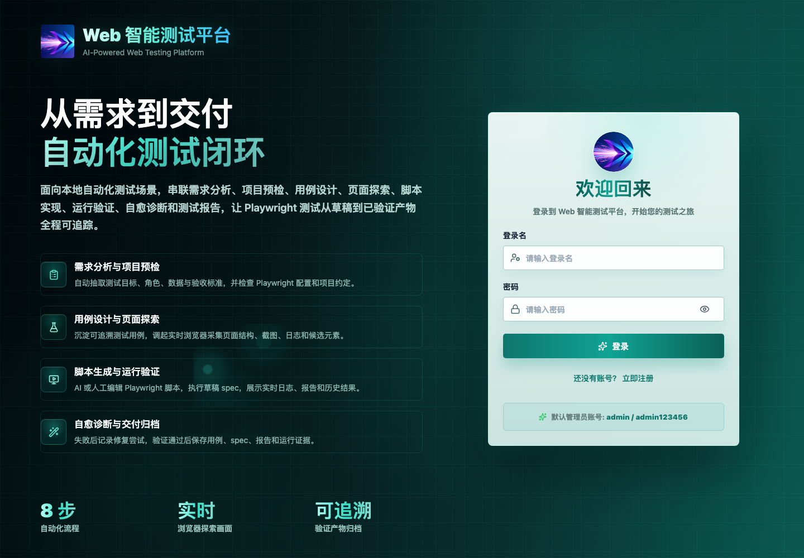

#### 主要业务规则

- 未登录用户只能访问登录、注册和健康检查等公开入口。
- 登录名不区分大小写并会去除空白，密码按原始内容校验。
- 待审核或已禁用账号不能登录。
- 登录成功后使用 HttpOnly 会话 Cookie，账号被禁用或会话过期后需要重新登录。
- 新密码至少 8 位，并同时包含字母和数字。
- 修改密码后应使用新密码重新验证登录，不向他人共享默认管理员账号。
- 免登录模式只用于本地开发或自动化验收，不能用于正式内网共享。

### 4.6 开发免登录模式

仅在本地开发或自动化验收时使用：

```bash
QA_AUTH_DISABLED=1 npm run dev:backend
```

该模式会以管理员权限运行，不适合团队共享和正式使用。

## 5. 首次使用初始化顺序

建议管理员按以下顺序完成平台初始化：

1. 使用部署时配置的初始密码登录，并修改管理员密码。
2. 在“项目管理”创建项目并配置仓库路径、测试目录和目标环境。
3. 在“功能配置”建立项目功能树。
4. 在需要导入脚本或运行凭据时配置环境变量。
5. 在“AI 配置”创建并测试至少一个模型配置。
6. 在“用户管理”审核团队账号并分配角色。
7. 使用一条低风险冒烟需求验证全流程是否可用。

## 6. 工作台通用操作

### 6.1 左侧导航

| 一级菜单 | 二级页面 | 用途 |
| --- | --- | --- |
| 工作台 | 总览、一键自动化 | 查看质量态势或启动端到端流程 |
| 人工工作台 | 需求工单、用例设计、探索实验室、脚本工作台、执行测试、自愈诊断 | 分阶段人工审阅、补充、接管和重跑 |
| 测试执行 | 测试套件、执行监控 | 管理回归集合并监控批量执行 |
| 资产管理 | 项目管理、用例管理、测试报告 | 管理正式测试资产和交付结果 |
| 系统设置 | 用户管理、AI 配置、功能配置 | 平台治理和基础配置 |

### 6.2 多页签工作区

- 点击左侧页面会在顶部打开模块页签。
- “总览”固定保留，其他页签可关闭。
- 页签、当前项目、主题等界面状态会保存在浏览器本地存储中。
- 测试套件编辑页存在未保存内容时，离开页面会提示确认。

### 6.3 顶部工具区

- 主题：深海、曜石蓝、松石绿、晨光。
- 通知：显示后端离线、AI 未配置、最近执行失败、流程异常等消息。
- 流程帮助：快速查看八阶段 QA 流程。
- 用户菜单：查看当前角色、修改密码、退出登录。
- 全局 AI 助手：可咨询当前页面、操作步骤、实际现象和预期结果；涉及写操作时会生成待确认动作，用户确认后才执行。

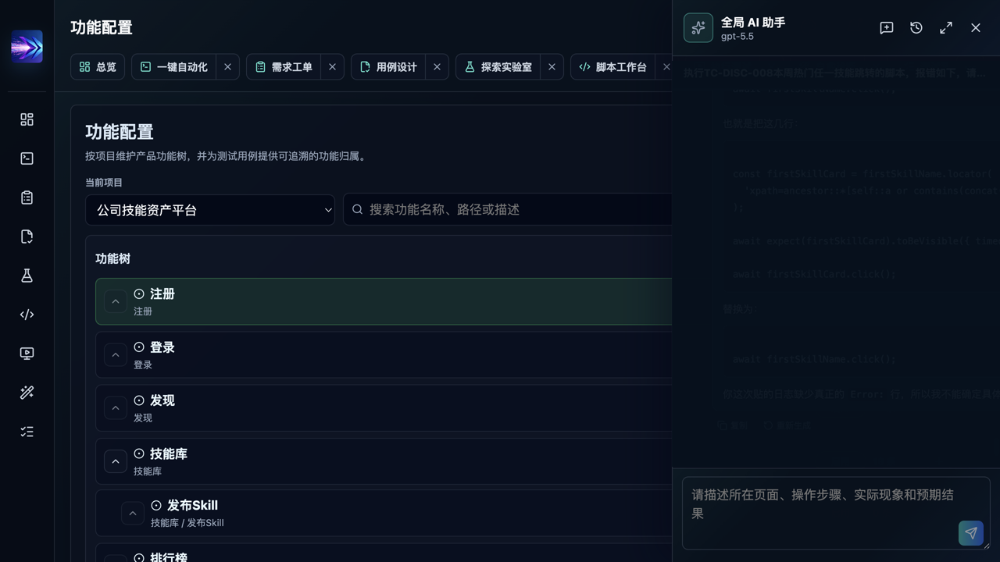

#### 主要业务规则

- 主题、菜单页签和当前项目属于浏览器本地偏好，不代表服务端业务状态发生变化。
- 通知中心汇总当前会话可观察到的异常，不代替执行监控和正式报告。
- 全局 AI 助手的回答属于辅助建议，不能直接作为测试通过结论。
- AI 建议涉及新增、修改或执行动作时，必须由有权限的用户确认后才会执行。
- 只读访客只能查询和咨询，不能确认写操作。
- 会话历史按当前登录用户隔离；删除会话不可撤销。

## 7. 系统配置

### 7.1 项目管理

项目是所有业务数据的归属边界。进入“资产管理 > 项目管理”后，可以按名称/编号、类型和状态筛选项目。

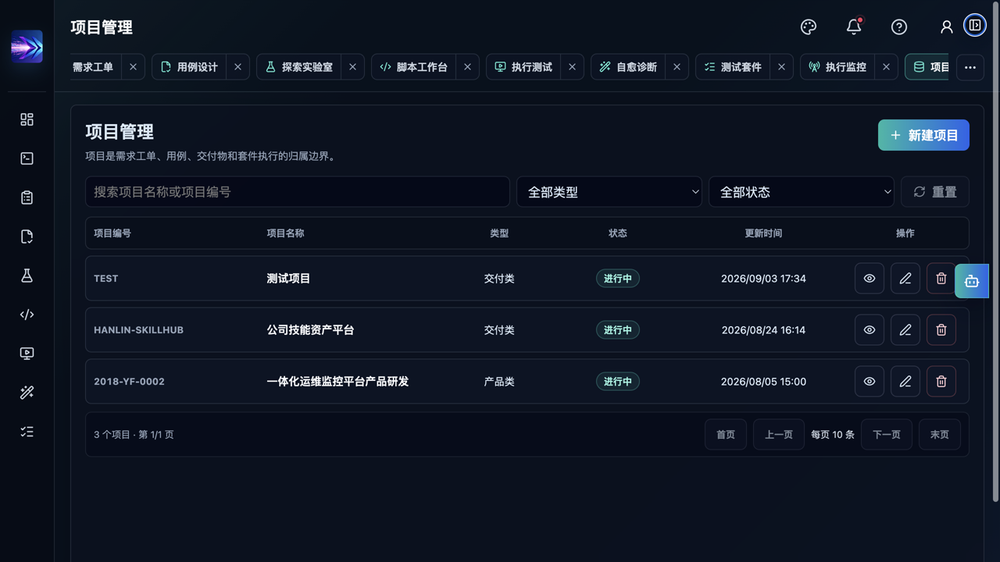

#### 主要业务规则

- 项目是工单、功能、用例、脚本、套件、运行和报告的最高业务归属边界。
- 只有管理员和测试负责人可以新建、编辑或删除项目；只读访客可查看，测试执行者不进入项目管理页面。
- 项目名称必填；项目编号为空时由系统生成，同一业务项目应长期使用稳定编号。
- 默认环境的 URL 同步为项目目标 URL，运行时可以选择其他已配置环境。
- 仓库路径必须指向平台运行机器可访问的本地工程，测试目录通常相对于仓库路径填写。
- 项目状态用于业务管理，不会自动迁移或删除关联资产。

#### 新建项目字段

| 字段 | 是否必填 | 说明 |
| --- | :---: | --- |
| 项目编号 | 否 | 留空时系统自动生成；建议使用稳定业务编号 |
| 项目名称 | 是 | 团队可识别的产品或交付项目名称 |
| 项目类型 | 否 | 产品类或交付类 |
| 项目状态 | 否 | 规划中、进行中、暂停、已完成、已归档 |
| 项目环境 | 建议 | 可维护多个环境名称和 URL，并指定默认环境 |
| 仓库路径 | 建议 | Playwright 工程所在绝对路径 |
| 测试目录 | 建议 | 默认 `tests/e2e` |
| 项目描述 | 否 | 记录范围、负责人、版本或交付说明 |

项目详情会显示基本信息、项目环境，以及关联的工单、功能、用例、套件、执行和交付物数量。

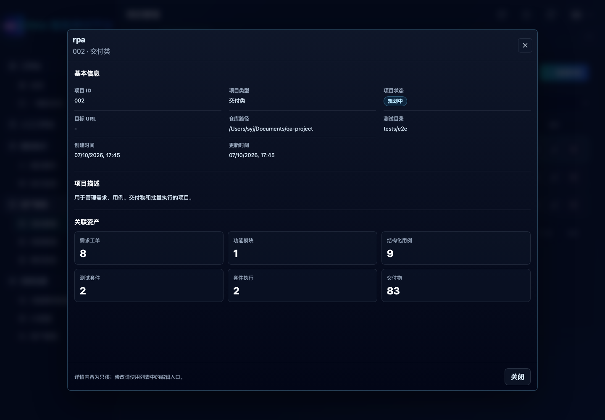

#### 删除项目

删除项目是永久级联操作。系统会先检查关联资产，再要求二次确认。级联删除可能同时清除工单、用例、脚本版本、运行日志、报告记录和受控生成文件。日常清理不应通过删除项目完成。

### 7.2 功能配置

进入“系统设置 > 功能配置”：

1. 选择当前项目。
2. 新增根功能，例如“登录与认证”。
3. 选择节点后新增子功能，例如“密码登录”“账号锁定”。
4. 填写功能名称、父功能、排序、启用状态和描述。
5. 保存后，该功能可用于工单和用例归属。

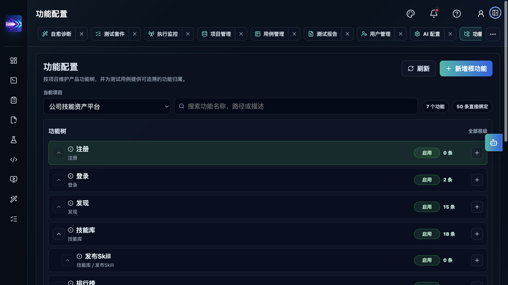

#### 主要业务规则

- 功能节点必须归属于一个项目，不允许跨项目设置父子关系。
- 只有管理员和测试负责人可以维护功能树。
- 功能名称必填；同级节点应使用可区分的业务名称。
- 父功能不能选择自身或自身后代，避免形成循环层级。
- 排序值决定同级功能显示顺序，不改变业务归属。
- 停用功能保留历史用例关系，但不应继续绑定新的测试任务。
- 删除已绑定用例的功能前必须检查影响；删除功能不等于删除测试用例。

功能层级不限制固定深度。停用功能仍可显示历史归属，但不应继续承接新测试任务。

### 7.3 项目环境变量

环境变量主要在导入脚本预检和运行前配置：

#### 主要业务规则

- 环境变量必须归属于一个具体项目环境，测试环境与生产环境的数据不得混用。
- 变量名在同一环境内唯一，并遵守环境变量命名规则。
- 平台保留变量不能被用户配置覆盖。
- 新增变量必须填写值；更新已配置密钥时留空表示保持原值。
- 标记为密钥的变量只保存密文，页面和接口不回显明文。
- 脚本声明的必需变量未配置时，“导入并验证”和正式运行应被阻止。
- 删除环境或清除变量前必须检查套件、工单和导入脚本的运行依赖。

- 普通变量示例：`BASE_URL`、`TENANT_ID`。
- 密钥变量示例：`QA_USERNAME`、`QA_PASSWORD`、`TOKEN`、`API_KEY`。
- 名称必须是合法环境变量名称，不能覆盖平台保留变量。
- 密钥在本地使用主密钥加密，读取接口只返回掩码和“已配置”状态。
- 已配置密钥输入框留空表示保持原值，不应反复填写或记录到需求正文中。
- 若更换或丢失主密钥，原有加密变量需要重新录入。

### 7.4 AI 配置

只有管理员可进入“系统设置 > AI 配置”。平台支持保存多个配置并切换当前生效模型。

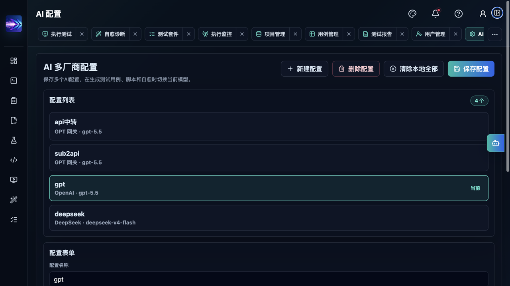

#### 主要业务规则

- 只有管理员可以查看和维护 AI 配置。
- 平台可以保存多个配置，但任一时刻只有一个“当前”配置参与生成任务。
- 修改厂商、模型、Base URL 或密钥后，原能力验证结果会失效，应重新测试连接。
- 测试连接通过只说明接口可调用，不保证模型输出始终满足用例或脚本质量要求。
- 环境变量配置优先于数据库配置；被环境变量锁定的 Key 和 Base URL 不能在页面覆盖。
- API Key 不应写入需求、用例、截图说明或版本库。
- 删除当前配置前应先切换到其他可用配置，否则 AI 能力会进入未配置状态。

配置字段：

- 配置名称。
- 厂商：OpenAI、GPT 网关、Anthropic、DeepSeek、自定义。
- API Key。
- 模型名称。
- Base URL。

推荐步骤：

1. 新建配置并填写厂商、Key、模型和 Base URL。
2. 点击“测试连接”，由平台发起一次极短真实请求。
3. 确认已识别 API 协议、结构化输出能力和验证时间。
4. 保存配置并点击“设为当前”。

若通过 `OPENAI_API_KEY`、`OPENAI_BASE_URL` 等环境变量启动后端，环境变量优先，页面不能覆盖或读取其明文。

### 7.5 用户管理

管理员可按账号/昵称、状态和角色筛选用户，并执行：

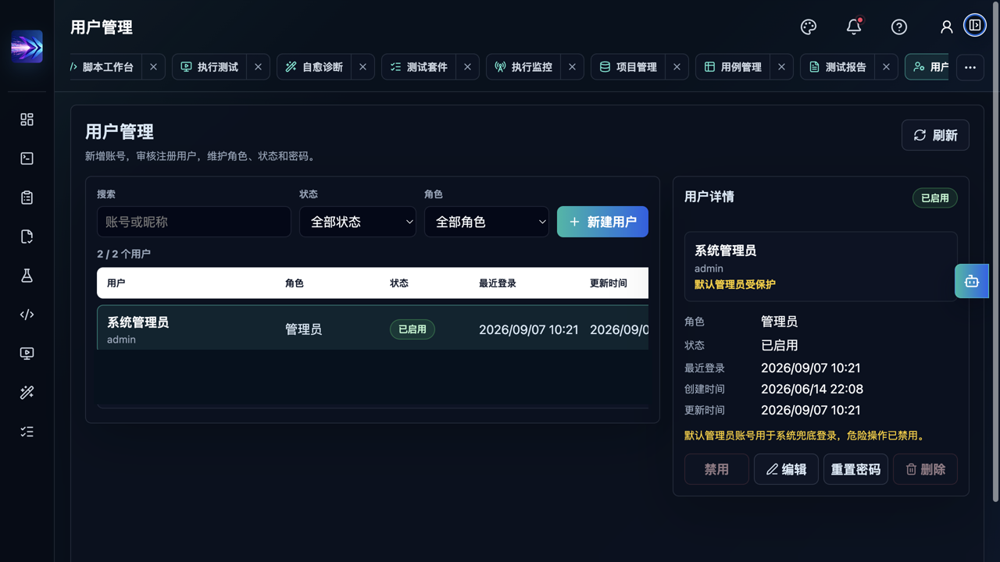

#### 主要业务规则

- 只有管理员可以进入用户管理并变更账号信息。
- 自助注册用户默认角色为只读访客、状态为待审核，启用后才能登录。
- 账号名创建后不允许随意修改；角色和状态由管理员维护。
- 禁用用户会使其现有登录会话失效，但不会删除其历史操作和业务资产。
- 重置密码后应通过安全渠道通知用户，不在测试报告或公共消息中传递密码。
- 默认 `admin` 账号受保护，不能禁用、删除或降级。
- 删除普通用户前应确认审计和责任追溯要求；用户创建的业务资产不会因此自动删除。

- 新建用户。
- 审核并启用待审核用户。
- 修改昵称、角色和状态。
- 重置密码。
- 禁用或删除普通用户。

默认 `admin` 账号受保护，不能禁用、删除或降级。

## 8. 一键自动化

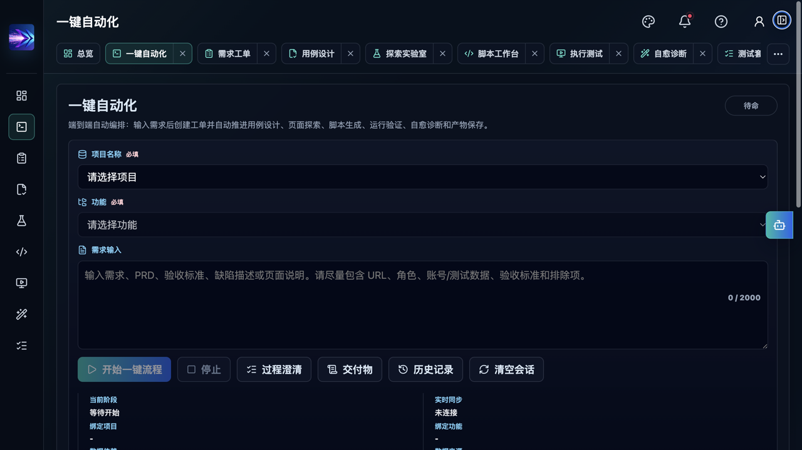

### 8.0 主要业务规则

- 项目、功能和需求文本均为启动必填项。
- 一次一键流程会创建一条真实需求工单，不是临时预览。
- 流程使用项目环境、工单数据和当前 AI 配置；启动后切换页面不会改变已绑定上下文。
- 页面探索允许人工接管，运行验证阶段的浏览器预览只读。
- 缺少账号、测试数据、环境变量或关键业务信息时，流程应进入阻塞或人工交接，而不是猜测继续。
- 数据准备计划必须先核对目标环境、创建范围和清理规则，再由用户批准。
- 自愈最多三轮，不允许通过删除断言、放宽业务标准或掩盖产品缺陷获得通过。
- 流程“已完成”仍可能带警告，必须同时检查失败数、未执行数和 P0 结果。
- 停止流程只终止后续编排，不自动删除已创建工单、运行记录和阶段产物。

### 8.1 适用场景

一键自动化适合需求相对完整、项目环境可访问、希望平台自动推进全链路的任务。它会真实创建需求工单，并把各阶段结果持续写入流程会话和交付物目录。

### 8.2 启动前检查

- 已创建项目。
- 项目下至少有一个可选功能。
- 项目仓库路径、测试目录和目标环境正确。
- 目标站点可从平台运行机器访问。
- 登录凭据或所需环境变量已准备。
- 需要 AI 生成时，当前 AI 配置已通过连接测试。
- 需求中没有要求删除生产数据、批量清空历史数据等高风险动作。

### 8.3 需求输入建议

一键流程要求选择“项目名称”和“功能”，需求文本最多 2000 字。建议包含：

```text
目标：要验证的业务能力
目标 URL：测试环境地址
角色：使用哪个业务角色
账号/数据：使用已配置环境变量，或说明测试数据前提
主流程：用户从哪里进入，执行哪些操作
验收标准：可观察、可断言的结果
异常场景：需要覆盖的错误或边界
排除项：明确不测的范围
数据清理：只清理本次创建且带唯一标记的数据
```

### 8.4 操作步骤

1. 进入“工作台 > 一键自动化”。
2. 选择项目。
3. 选择功能。
4. 输入完整需求。
5. 点击“开始一键流程”。
6. 观察阶段进度、实时浏览器、过程澄清、流程会话和实时日志。
7. 如流程要求数据准备审批，核对数据计划、目标环境和清理方式后再确认。
8. 流程结束后检查 P0 通过数、失败数、未执行数和失败原因。
9. 打开交付物目录检查测试用例、脚本、运行摘要和报告。

### 8.5 八个阶段的业务含义

| 阶段 | 平台动作 | 用户应关注 |
| --- | --- | --- |
| 需求分析 | 抽取目标、角色、路径、数据、验收和排除项 | 是否误解业务目标，是否缺少必要信息 |
| 项目预检 | 检查 Playwright 配置、测试目录、脚本、已有 spec 和 helper | 仓库路径与工程约定是否正确 |
| 用例设计 | 生成并保存可追溯用例 | P0 主流程、异常场景和边界是否合理 |
| 页面探索 | 启动浏览器，执行状态路径并采集元素与证据 | 是否到达正确页面，定位是否稳定 |
| 脚本实现 | 为用例生成逐用例 spec 和共享 Fixture | 脚本是否使用确认后的元素和正确环境 |
| 运行验证 | 执行草稿脚本并生成 HTML Report | 失败属于脚本、数据、环境还是产品 |
| 自愈诊断 | 最多三轮生成修复并重跑 | 不应把真实产品缺陷“修成通过” |
| 保存已验证产物 | 归档用例、脚本、报告和运行证据 | 只发布真正通过或经负责人确认的结果 |

### 8.6 运行中操作

- “停止”：请求终止当前流程。
- “重试页面探索”：保留原工单和原用例，只重新执行探索。
- “过程澄清”：查看各阶段缺失信息、阻塞和人工确认项。
- “交付物”：打开阶段产物目录和内容预览。
- “历史记录”：回看以往一键流程。
- “清空会话”：清理当前浏览器界面中的会话上下文，不等同于删除历史业务资产。

探索阶段的实时浏览器可以暂停、人工接管和继续；运行验证阶段为只读预览，避免人工操作污染自动化结果。

### 8.7 结果判读

- `已完成`：流程达到终态，仍需检查是否存在警告或未执行项。
- `已完成，有警告`：部分目标完成，存在失败、阻塞或未执行用例。
- `失败`：执行或生成环节出现错误，需要查看失败用例、日志和报告。
- `阻塞`：缺少账号、数据、环境或必须由人工确认的业务信息。
- `已取消`：用户停止流程或任务被取消。

出现人工交接提示时，点击进入人工工作台，围绕原工单继续处理，不要重复新建同一需求。

## 9. 人工工作台

人工工作台与一键流程共享同一套工单和资产，不是独立系统。它适用于人工审阅、局部修正、单步重跑和失败接管。

### 9.1 需求工单

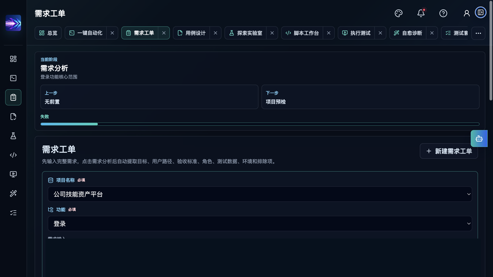

#### 主要业务规则

- 每个需求工单必须绑定一个项目和一个可用功能。
- 新需求应新建工单；修正同一任务时应更新原工单，避免重复资产。
- 需求正文是业务事实来源，AI 抽取结果不能反向覆盖用户未确认的规则。
- URL、角色、测试数据、验收标准和排除项缺失时，应在用例设计前补齐或明确标记待确认。
- 工单项目一旦产生用例、脚本和运行记录，不应随意变更归属项目。
- 项目预检异常不会自动修改被测仓库，用户需要先修正仓库路径、Playwright 配置或测试目录。
- 测试执行者可创建和修改工单，只读访客仅能查看。

操作步骤：

1. 进入“人工工作台 > 需求工单”。
2. 点击“新建需求”开始新任务，或从总览/历史记录选择已有工单。
3. 选择项目和功能。
4. 输入需求、PRD、验收标准、缺陷描述或页面说明。
5. 点击“需求分析”或保存修改。
6. 核对需求抽取结果：功能目标、用户路径、验收标准、角色、测试数据、环境、排除项。
7. 核对项目预检摘要：Playwright 配置、测试目录、已有测试、测试脚本、Fixture/Helper 和 Locator 风格。
8. 确认后进入“用例设计”。

### 9.2 用例设计

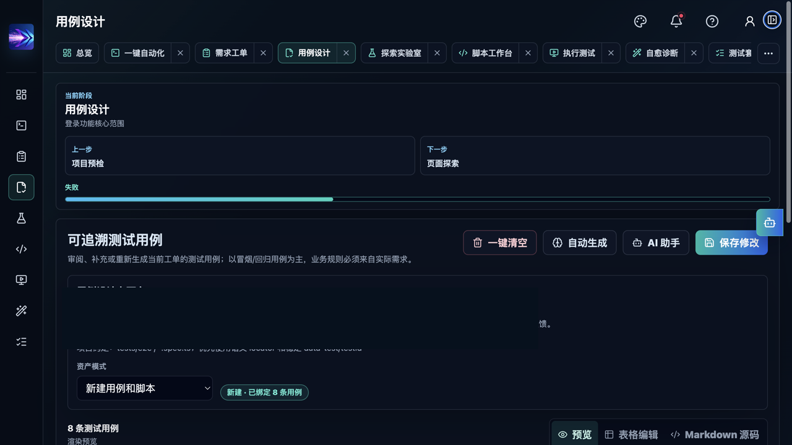

#### 主要业务规则

- 用例必须来源于当前工单的需求、验收标准或已确认页面事实。
- 项目内用例 ID 唯一；修改已有用例时不能随意更换 ID。
- P0 覆盖交付阻断主流程，P1 覆盖重要回归，P2 用于补充和低风险场景。
- 至少保留一条有效用例；删除已保存用例前应检查脚本、套件和报告引用。
- AI 助手的新增、修改和删除建议先应用到草稿，点击“保存修改”后才写入结构化用例。
- 刷新替换只作用于本次绑定目标，不能借此覆盖其他工单的同名用例。
- 追加模式不静默复活已删除的旧 ID，冲突时系统会生成或要求确认新的唯一 ID。
- 用例变更后，已有脚本可能变为过期状态，必须重新同步和验证。

#### 资产模式

| 模式 | 用途 | 注意事项 |
| --- | --- | --- |
| 新建 | 新需求首次创建用例和脚本 | 默认模式 |
| 刷新替换 | 用新设计替换本次绑定的已有用例 | 适合需求整体变更，需谨慎检查删除项 |
| 追加 | 在已有资产上补充覆盖点 | 适合缺陷回归和增量场景 |

#### 操作方式

- “自动生成”：基于工单上下文生成用例草稿。
- “AI 助手”：针对当前草稿提出新增、修改或删除建议；应用建议只更新草稿，仍需统一保存。
- “保存用例”：将当前草稿解析并保存为结构化用例。
- 预览模式：便于审阅最终 Markdown 展示。
- 表格模式：逐条新增、编辑、删除或让 AI 修改。
- 源码模式：直接编辑 Markdown 表格。

正式用例推荐表头：

```markdown
| ID | 优先级 | 标题 | 覆盖需求 | 前置条件/测试数据 | 步骤 | 期望结果 | 自动化说明 |
| --- | --- | --- | --- | --- | --- | --- | --- |
| TC-LOGIN-001 | P0 | 有效账号登录成功 | 用户登录主流程 | 测试账号已启用 | 打开登录页；输入账号密码；点击登录 | 进入首页并显示用户信息 | 使用 role/label/testid 定位 |
```

用例设计原则：

- P0 表示阻断交付的主流程，P1 表示重要回归，P2 表示低风险或补充场景。
- 一个用例只描述一个清晰场景。
- 标题采用“条件或操作 + 预期结果”，避免“测试/验证/检查”等空泛前缀。
- 前置条件、步骤和期望结果必须可执行、可观察。
- 业务规则必须来自需求或已确认事实，不能让 AI 自行补造。
- 删除已保存用例时，先核对套件、脚本和报告影响。

### 9.3 探索实验室

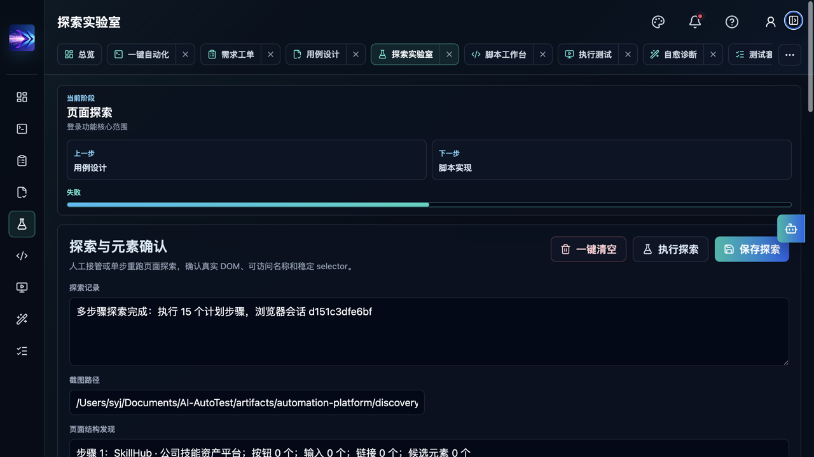

#### 主要业务规则

- 当前工单没有已保存测试用例时不能执行页面探索。
- 探索必须使用明确的目标 URL 和运行环境，不应在生产环境进行破坏性操作。
- 自动发现的候选元素不是正式 Locator，至少经过规则筛选或人工确认后才能保存。
- 目标控件未解析、状态路径不完整或页面未到达时，应保留失败证据并修复定位。
- 人工接管期间的点击和输入会影响浏览器状态，接管完成后应让计划从可解释状态继续。
- 证据截图只用于归档；实时操作通过 WebSocket 和 CDP 画面完成。
- 单用例调试模式下，探索范围必须限定在当前用例或其最小依赖状态路径。
- 清空本页数据只清除当前工单对应阶段数据，不应作为全量数据清理手段。

页面探索用于确认真实 DOM、可访问名称和稳定 selector。

操作步骤：

1. 确保当前工单已有测试用例。
2. 点击“执行探索”。
3. 观察预探索页面、页面控件、候选元素、目标控件覆盖、最短状态路径和缺失必需控件。
4. 必要时在实时浏览器中点击、滚动或输入；也可以暂停、人工接管、继续。
5. 对定位失败的目标使用“定位修复”，从候选控件中选择正确项。
6. 检查计划步骤状态和步骤证据。
7. 在“已确认元素”中确认、修改或新增 Locator。
8. 至少确认一个有效元素后点击“保存探索”。

Locator 类型包括：`role`、`label`、`placeholder`、`text`、`testid`、`selector`。优先使用面向用户语义且稳定的 `role`、`label`、`testid`，谨慎使用脆弱 CSS 层级选择器。

### 9.4 脚本工作台

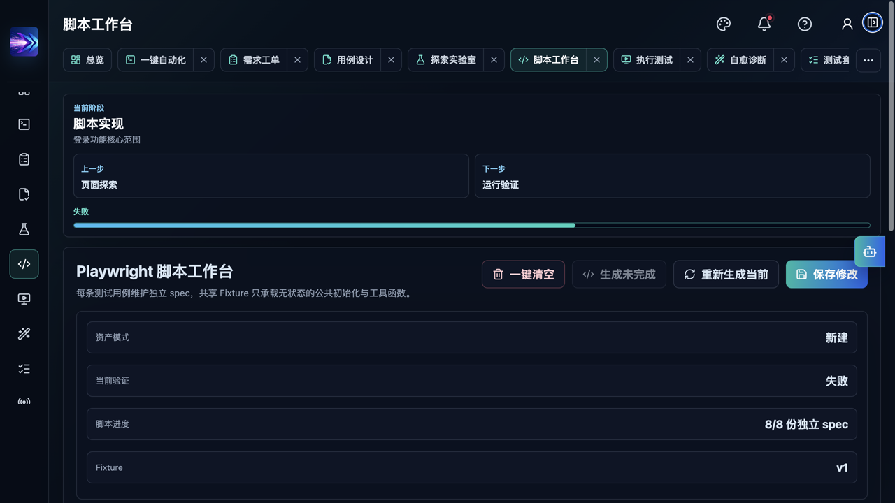

#### 主要业务规则

- 一条结构化用例对应一份可独立识别和执行的 Playwright spec。
- 测试标题必须保留用例 ID，确保运行结果可以回写到正确用例。
- 共享 Fixture 只承载无状态初始化和公共工具，不保存用例之间的业务状态。
- 批量生成只补齐缺失脚本；已有脚本不会被无提示覆盖。
- 单条生成失败不阻断后续用例，失败项通过“重试失败”单独处理。
- 用例已更新时，过期脚本不能直接作为最新正式版本发布。
- 人工保存的脚本仍是候选版本，必须经过真实运行验证。
- 单用例调试共享 spec 时，应完整保留原有 hook、helper、describe 和动态注册结构。

脚本工作台按测试用例维护独立 Playwright spec，共享 Fixture 只放无状态的公共初始化和工具函数。

常用操作：

- “自动生成”：只补齐缺失脚本，并按用例逐条流式生成。
- “重试失败”：只重试本批次生成失败的用例。
- “重新生成当前用例”：只替换当前用例脚本草稿。
- “保存当前脚本”：保存人工修改。
- “应用 Fixture 到全部脚本”：把共享 Fixture 更新到全部逐用例脚本。

脚本状态：

- 待生成。
- 排队中。
- 生成中。
- 生成失败。
- 已生成并显示版本号。
- 用例已更新：说明用例内容晚于脚本，需要先同步或重新生成。

单条生成失败不会中断后续用例；连续 60 秒没有模型数据才判定超时。

### 9.5 执行测试

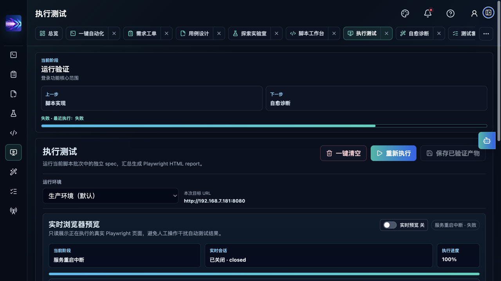

#### 主要业务规则

- 没有可执行脚本版本时不能启动运行。
- Run 在创建时固定脚本版本和运行环境，运行中切换页面选择不会改变该 Run。
- 执行浏览器预览只读，人工操作不得介入正在验证的页面状态。
- `passed` 只表示脚本断言通过，仍需确认断言是否覆盖业务验收标准。
- `failed` 应结合日志、截图、失败步骤和 HTML Report 判断根因。
- `skipped` 不计为通过，必须说明是缺少脚本、条件不满足还是策略跳过。
- 单用例模式只验证当前候选脚本；依赖组模式覆盖维持该场景所需的最小相关测试。
- 普通手工流程只有管理员或测试负责人可以保存已验证产物。

普通工单执行会运行当前脚本批次中的独立 spec，并汇总生成 Playwright HTML Report。

1. 选择运行环境；未选时使用项目默认环境或工单 URL。
2. 点击“开始执行”。
3. 通过只读实时浏览器观察当前页面，不要尝试人工修改执行状态。
4. 查看运行进度、日志、截图和最终状态。
5. 运行通过后，由管理员或测试负责人点击“保存已验证产物”。

单用例调试时可以选择：

- 当前用例：只运行候选脚本。
- 依赖组：运行该用例所在的最小依赖组。

### 9.6 自愈诊断

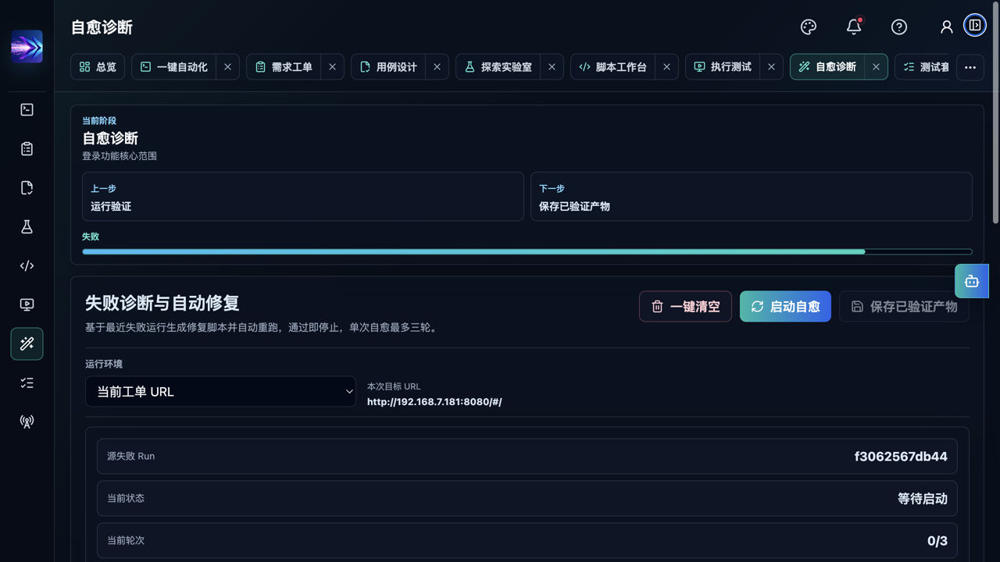

#### 主要业务规则

- 只有存在最近失败 Run 和可定位失败脚本时才应启动自愈。
- 自愈固定使用选择的重跑环境，不因后续页面切换而改变。
- 单次自愈最多三轮，通过后立即停止。
- 测试脚本问题可以自动修复；账号、环境和数据问题应先补齐运行条件。
- 产品行为与验收标准不一致时必须停止自愈并人工确认。
- 自愈脚本不得删除核心断言、把精确断言改为无意义可见性检查或增加无限等待。
- 每轮修复、来源 Run、重跑 Run、诊断分类和证据都必须保留。
- 自愈通过后仍需管理员或测试负责人审阅并发布。

自愈基于最近失败 Run 的证据生成修复脚本并自动重跑，最多三轮，通过即停止。

根因分类包括：

- 测试脚本问题。
- 账号/环境待确认。
- 产品行为与预期不一致。
- 根因待确认。

处理动作包括：

- 自动修复脚本。
- 原脚本确认复跑。
- 停止自愈并人工确认。

使用原则：

- 只有测试代码或稳定定位问题适合自动修复。
- 账号、环境和测试数据问题应先修复运行条件。
- 产品行为与验收标准不一致时应保留失败，不得通过弱化断言“修复”测试。
- 自愈通过后仍需负责人审阅脚本差异，再保存或发布。

## 10. 用例资产管理

进入“资产管理 > 用例管理”，可以按项目、优先级、状态、功能和关键词筛选结构化用例。

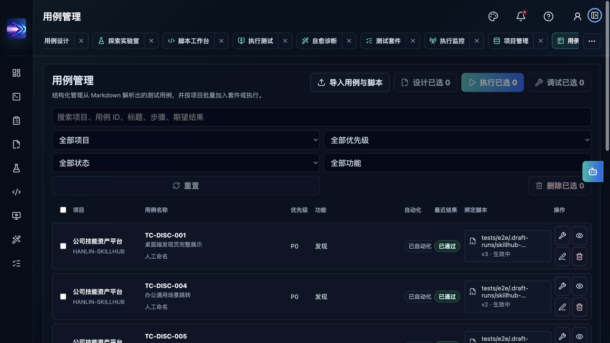

### 10.0 主要业务规则

- 用例管理展示的是已经保存入库的结构化用例，不包含尚未保存的编辑器草稿。
- 用例始终归属于单一项目，可以选择性绑定功能和来源工单。
- 多选执行可以临时组织运行，但不会自动创建长期测试套件。
- 多选调试至少选择两条用例，且所有用例必须来自同一项目。
- 正式脚本与待验证候选脚本应明确区分，候选脚本通过后才能发布替换。
- 测试执行者可以导入、执行和调试，但正式编辑、批量删除和发布由管理员或测试负责人控制。
- 删除用例前必须检查套件成员关系、脚本版本和报告历史；删除操作不可作为数据去重捷径。
- 列表中的“最近结果”只代表该用例最近一次独立执行，不等于所在工单或套件整体结果。

### 10.1 列表信息

列表展示：

- 所属项目。
- 用例 ID 和标题。
- 优先级。
- 功能归属。
- 自动化状态。
- 最近执行结果。
- 已绑定脚本或待验证脚本。

### 10.2 常用操作

- 设计用例：进入工单用例设计流程。
- 执行已选：批量执行选中用例。
- 调试已选：至少选择两条同项目用例，先执行批量调试预检。
- 调试当前用例：创建隔离调试会话。
- 查看详情：查看需求、步骤、期望、脚本和运行信息。
- 编辑：修改结构化用例字段。
- 删除：仅管理员或测试负责人可执行。

多选调试只支持同一项目，因为不同项目的环境、仓库和脚本约定可能不同。

### 10.3 导入用例与 Playwright 脚本

准备两份文件：

1. Markdown 用例表。
2. 自包含的 Playwright TypeScript spec。

导入步骤：

1. 点击“导入用例与脚本”。
2. 选择项目和可选功能。
3. 上传 Markdown 与 spec。
4. 点击“开始预检”。预检只做结构、依赖、动态测试发现和 ID 绑定检查，不执行目标系统测试。
5. 核对每个 Markdown 用例 ID 是否唯一匹配一条 Playwright 测试。
6. 选择验证环境并补齐缺少的环境变量。
7. 选择“仅导入用例库”或“导入并验证”。

导入约束：

- 项目内相同用例 ID 会被拒绝，不会静默覆盖或重新编号。
- spec 中的测试标题必须包含可唯一识别的用例 ID。
- 共享 `describe`、`beforeEach`、helper 和循环动态注册测试可以被 Playwright `--list` 发现。
- 外部 fixture、Page Object 和第三方依赖需要先改造成自包含脚本。
- “导入并验证”前必须补齐所有必需环境变量。

### 10.4 单用例调试与发布

单用例调试会创建隔离草稿：

1. 在用例列表点击“调试当前用例”。
2. 在用例设计中只修改当前用例。
3. 必要时执行限定范围的页面探索。
4. 生成或编辑候选脚本。
5. 选择当前用例或依赖组执行。
6. 失败时进行单用例自愈。
7. 通过后由管理员或测试负责人发布。

若正式用例在调试期间已被其他人更新，会话会标记为过期，需要先同步最新用例，避免覆盖他人修改。

## 11. 测试套件

测试套件用于把同一项目下的稳定用例组织为可重复执行的集合，例如“每日冒烟”“结算回归”“发布前 P0”。

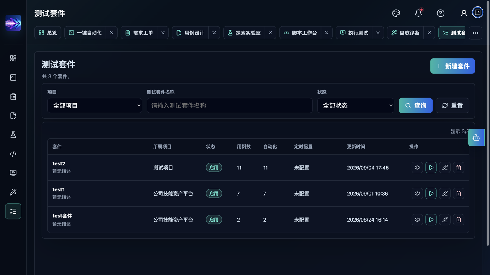

### 11.0 主要业务规则

- 一个套件只能归属于一个项目，不能包含跨项目用例。
- 只有管理员和测试负责人可以创建、编辑、停用或删除套件。
- 管理员、测试负责人和测试执行者可以执行已启用且非空的套件。
- 停用套件不能执行，但会保留历史配置和运行记录。
- 未绑定可执行 spec 的用例可以保存在套件中，运行时按跳过处理并记录原因。
- 套件执行创建独立的套件 Run，并为每条用例关联单次 Run 和结果。
- “失败即停”只阻止后续用例启动，不删除已完成用例结果。
- 重试次数最多为 3；重试不能用于掩盖稳定复现的产品缺陷。
- 当前定时配置仅保存计划，不会自动触发任务。

### 11.1 创建套件

1. 进入“测试执行 > 测试套件”。
2. 点击“新建测试套件”。
3. 填写套件名称、状态和描述。
4. 配置运行模式。
5. 从项目/功能树中选择测试用例。
6. 保存套件。

### 11.2 运行配置

| 配置 | 可选值/范围 | 说明 |
| --- | --- | --- |
| 执行方式 | 稳健串行 | 当前固定为串行 |
| 失败策略 | 失败继续、失败即停 | 决定单条失败后是否继续 |
| 重试次数 | 0-3 | 用于临时不稳定失败 |
| 默认运行环境 | 项目默认环境或指定环境 | 执行前仍可再次选择 |
| 仅运行上次失败用例 | 开/关 | 用于快速复验失败集 |

### 11.3 定时配置

可保存关闭、每天、每周或固定间隔计划，包含时间、星期、间隔分钟、时区和备注。当前版本只保存配置，尚未接入自动调度触发；需要人工启动套件执行。

### 11.4 用例选择规则

- 选择第一条用例后，套件项目会被锁定。
- 同一套件不能包含跨项目用例。
- 可以按项目、功能、关键词和优先级筛选。
- 未绑定可执行 spec 的用例可以加入套件，但执行时会跳过并提示原因。
- 停用套件和空套件不能执行。

## 12. 执行监控

执行监控用于查看套件和批量用例运行状态。

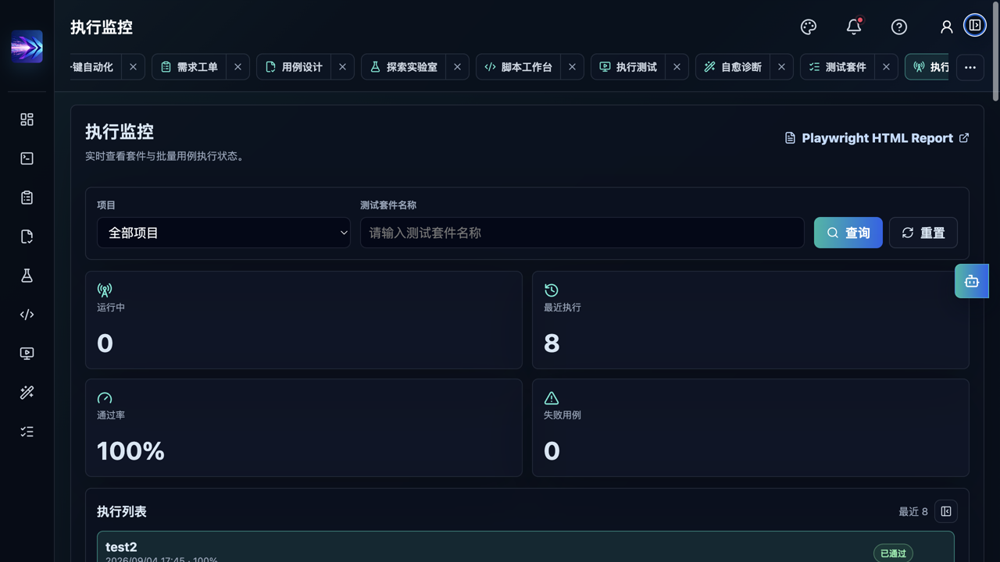

### 12.0 主要业务规则

- 执行监控以套件 Run 或临时批量 Run 为查询单位，不直接修改测试结果。
- 页面会自动轮询状态、用例明细和日志，运行中数据可能持续变化。
- 聚合通过率应以终态用例为基础，排队中和运行中不能提前计为通过。
- 套件结果由用例结果汇总：存在失败通常判为失败，无失败且有通过判为通过，全部未执行时可能显示跳过。
- 浏览器画面只读，用于观察当前执行，不允许接管改变页面状态。
- 单用例报告入口只有在分配了具体 Run 并生成报告后才可用。
- 删除执行记录属于历史数据删除，仅有权限角色可操作，运行中的记录不能删除。
- 查询条件只影响列表展示，不会停止、重启或重排后台任务。

### 12.1 查询与总览

- 按项目和套件名称查询。
- 查看运行中数量、最近执行、通过率和失败用例数。
- 左侧执行列表显示开始时间、状态和进度。

### 12.2 执行详情

详情区域展示：

- 总数、通过、失败、跳过、耗时和运行环境。
- 当前用例、单次 Run、浏览器会话和实时连接状态。
- 只读执行浏览器画面。
- 每条用例的状态、耗时和独立报告入口。
- 聚合日志及日志级别筛选。

执行状态、用例结果和日志会自动轮询刷新。运行中的记录不能作为最终结论，应等待状态进入通过、失败、跳过、取消或阻塞等终态。

## 13. 测试报告与交付物

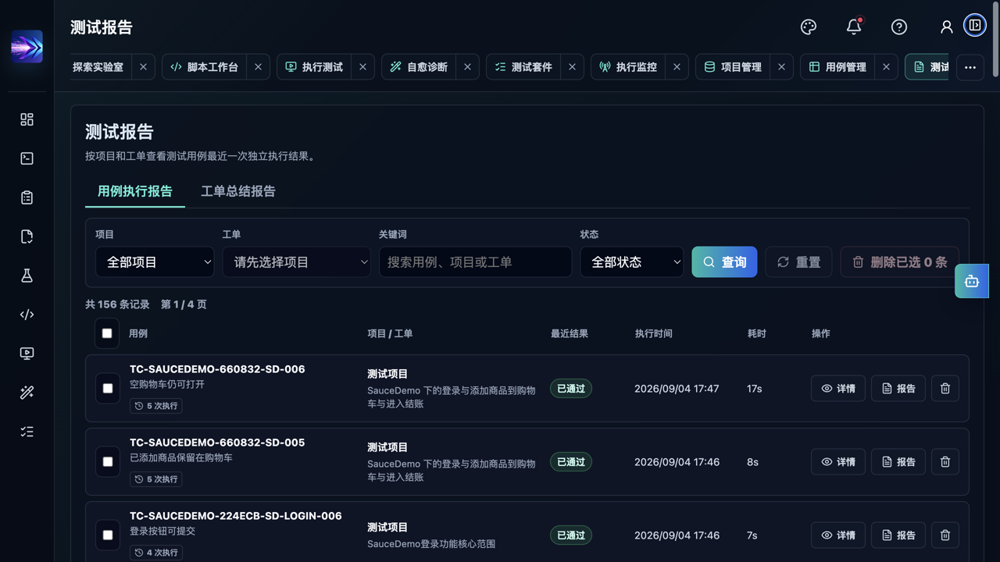

### 13.0 主要业务规则

- 用例执行报告与工单总结报告是两类独立记录，不能相互替代。
- 报告必须保留项目、工单、用例、Run 和版本关联，避免脱离上下文单独判断。
- 用例报告的“最近结果”不覆盖历史记录，详情中可以切换执行历史。
- 工单总结报告采用版本管理，新版本不会静默删除旧版本。
- HTML Report 是执行证据，人工总结报告用于业务结论和范围说明。
- 报告中的失败原因应来自真实运行、日志或人工确认，不应由 AI 无依据生成。
- 运行中报告不能作为最终交付，也不能执行删除。
- 批量删除单次最多处理 200 条，且只允许管理员或测试负责人执行。
- 删除数据库报告记录前必须核对对应文件和共享使用场景。

### 13.1 报告类型

“资产管理 > 测试报告”包含两个视图：

| 报告类型 | 内容 | 典型用途 |
| --- | --- | --- |
| 用例执行报告 | 每条测试用例最近一次独立执行结果及历史 | 定位具体失败和查看单用例证据 |
| 工单总结报告 | 工单级总结、状态、版本和历史 | 对需求测试整体签收与交付 |

### 13.2 查询条件

- 项目。
- 工单。
- 关键词。
- 状态。

用例报告状态包含暂无报告、排队中、运行中、已通过、失败、跳过；工单总结报告状态包含已生成、草稿、已归档等。

### 13.3 报告详情

详情中可查看：

- 基本元数据和执行环境。
- 摘要与失败原因。
- 执行日志。
- 历史执行或版本。
- Playwright HTML Report 或渲染后的 Markdown 报告。

删除报告仅开放给管理员和测试负责人，且活动中的运行记录不能删除。

### 13.4 默认文件位置

| 产物 | 默认位置 |
| --- | --- |
| Playwright 最新报告 | `playwright-report/index.html` |
| Run 归档报告 | `artifacts/automation-platform/playwright-reports/runs/` |
| 套件归档报告 | `artifacts/automation-platform/playwright-reports/suites/` |
| 一键流程产物 | `artifacts/automation-platform/flow-runs/` |
| 项目交付物 | `artifacts/projects/` |
| 浏览器与运行证据 | `artifacts/automation-platform/` |
| 草稿运行文件 | `tests/e2e/.draft-runs/`、`tests/e2e/.live-runs/` |
| Playwright 失败证据 | `test-results/` |

草稿目录不是正式交付目录。正式测试用例、spec 和人工报告只有在验证通过并执行保存/发布动作后才应进入交付链路。

## 14. 总览指标的业务解读

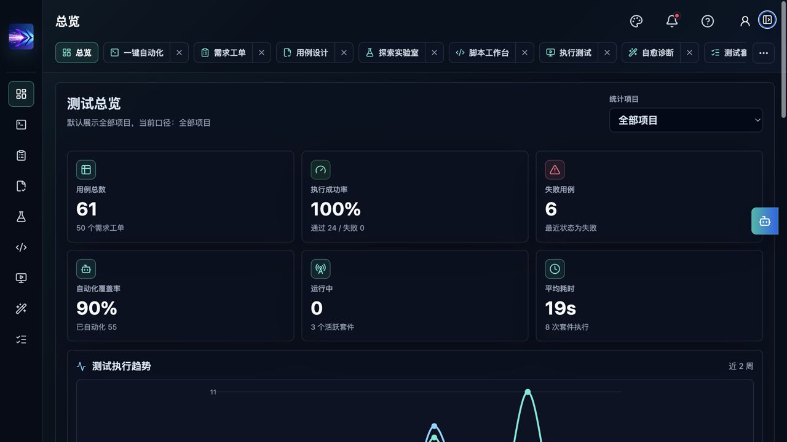

### 14.1 主要业务规则

- 总览默认统计全部项目，切换项目后所有指标应按同一项目口径理解。
- 用例总数取结构化用例资产，不包含尚未保存的 Markdown 草稿。
- 执行成功率基于统计范围内的终态执行，跳过项不应被解释为通过。
- 自动化覆盖率表示已绑定自动化能力的用例比例，不代表这些用例当前全部通过。
- 失败热点用于识别重复失败，不直接判断根因或责任方。
- 最近执行展示套件或批量执行摘要，点击后应进入执行监控查看明细。
- 工单阶段分布反映当前流程停留位置，长期集中在探索或自愈通常意味着环境、定位或需求质量问题。
- 总览指标用于管理判断，正式签收仍以具体 Run、用例报告和工单总结报告为准。

总览默认统计全部项目，也可以切换到单个项目。主要区域包括：

- 测试执行趋势：观察一段时间内执行量和质量走势。
- 结果分布：通过、失败、跳过等占比。
- 优先级分布：P0/P1/P2 用例结构是否合理。
- 工单阶段分布：任务集中在哪个环节，是否存在流程拥堵。
- 最近执行：快速进入套件执行详情。
- 失败热点：识别重复失败用例。
- 最近任务：快速切换当前需求工单。

业务上应优先关注 P0 失败、持续重复失败、长期停留在页面探索/自愈阶段的工单，以及未形成正式报告的已完成任务。

## 15. 推荐业务流程

### 15.1 新需求自动化验收

1. 负责人确认项目、功能和测试环境已配置。
2. 执行者在一键自动化输入需求。
3. 负责人审阅 P0 用例和过程澄清。
4. 执行者在必要时接管页面探索。
5. 平台生成脚本并运行。
6. 失败按脚本、数据环境、产品问题分类。
7. 通过后由负责人保存已验证产物。
8. 在工单总结报告中完成结果审阅。

### 15.2 缺陷修复定向回归

1. 在需求工单中描述缺陷现象、修复点和验收标准。
2. 资产模式选择“追加”，补充缺陷复现和正常回归用例。
3. 只探索受影响页面和控件。
4. 生成缺失脚本或更新受影响脚本。
5. 执行当前工单或选中用例。
6. 通过后加入既有回归套件。

### 15.3 失败用例快速修复

1. 在执行监控或报告中定位失败用例。
2. 从用例管理进入单用例调试。
3. 判断正式用例是否仍符合业务预期。
4. 修复 Locator、等待条件、测试数据或脚本逻辑。
5. 先运行当前用例，再按需要运行最小依赖组。
6. 通过后由负责人发布。

### 15.4 已有 Playwright 资产接入

1. 整理 Markdown 用例表和自包含 spec。
2. 确保测试标题包含唯一用例 ID。
3. 执行导入预检。
4. 补齐环境变量。
5. 先选择“导入并验证”。
6. 验证通过后再将用例加入正式套件。

## 16. 状态字典

| 系统状态 | 中文含义 | 建议动作 |
| --- | --- | --- |
| `draft` | 草稿 | 继续编辑，不作为正式交付 |
| `designed` | 已设计 | 检查是否已具备自动化条件 |
| `exploring` | 探索中 | 观察浏览器和步骤日志 |
| `explored-draft` | 探索待确认 | 人工确认元素后保存 |
| `script-ready` | 脚本就绪 | 进入运行验证 |
| `queued` | 排队中 | 等待浏览器资源 |
| `running` | 运行中 | 等待终态，不提前判定结果 |
| `passed` | 已通过 | 核对证据后保存/发布 |
| `failed` | 失败 | 查看失败原因、日志和报告 |
| `partial` | 部分通过 | 明确未通过范围和交付影响 |
| `skipped` | 跳过 | 检查是否缺少脚本或前置条件 |
| `blocked` | 阻塞 | 补充账号、数据、环境或人工确认 |
| `healing` | 自愈中 | 审阅修复方向，防止弱化断言 |
| `completed` | 已完成 | 继续核对是否带警告 |
| `cancelled` | 已取消 | 判断是否需要重新发起 |
| `artifacts-saved` | 已保存交付物 | 正式资产已进入交付链路 |

## 17. 数据与安全规范

### 17.1 测试数据清理

- 创建测试数据时必须添加唯一标记，推荐 `CODEX_TEST_YYYYMMDD_HHMMSS`、`TC-CODEX-*` 或任务专用前缀。
- 测试完成后只删除本次创建且能通过唯一标记确认的数据。
- 无法确认归属的数据默认保留。
- 不使用 `/api/test/reset` 等全量重置方式，除非用户明确要求。
- 不通过删除项目、清空数据库或批量删除历史报告来完成一次测试的数据收尾。

### 17.2 账号与密钥

- 全新数据库通过 `QA_BOOTSTRAP_ADMIN_PASSWORD` 设置管理员初始密码，正式使用前完成修改。
- 不把真实密码、Token 或 API Key 写入需求、用例、日志和 Git 文件。
- 使用项目环境变量保存运行凭据，并把敏感项标记为密钥。
- 共享内网部署不要关闭鉴权。
- 只给用户分配完成职责所需的最低权限。

### 17.3 产物发布

- AI 生成的用例和脚本先视为草稿。
- 运行通过不代表业务一定正确，仍需核对断言和验收标准。
- 自愈后的脚本必须审阅差异。
- 只有管理员或测试负责人执行“保存已验证产物”或“发布”。

## 18. 常见问题排查

### 18.1 页面提示“后端连接失败”

```bash
curl --noproxy '*' http://127.0.0.1:8001/api/health
```

- 无响应：检查后端是否启动、端口是否被占用。
- 健康检查正常但业务接口返回 401：重新登录，检查登录态和访问域名。
- 本地代理干扰：设置 `NO_PROXY='127.0.0.1,localhost,*'`。

### 18.2 `.venv/bin/python` 不存在

```bash
python3 -m venv .venv
.venv/bin/python -m pip install -r backend/requirements.txt
```

### 18.3 AI 显示未配置或连接失败

- 确认当前配置已保存并设为生效。
- 检查 Base URL 是否包含正确 API 前缀。
- 检查模型名称是否存在且账号有权限。
- 点击“测试连接”查看真实错误。
- 若配置来自环境变量，前端无法显示或复制明文属于正常行为。

### 18.4 一键流程无法开始

- 项目、功能和需求均为必填。
- 当前角色必须具备执行权限。
- 同一界面已有流程运行时需等待或停止原流程。
- 项目没有功能时先进入功能配置创建节点。

### 18.5 页面探索失败

- 检查目标 URL、网络、证书和登录前置。
- 检查测试用例是否包含明确状态路径。
- 通过人工接管到达目标页面。
- 使用定位修复选择正确候选控件。
- 对动态页面优先补充可访问名称或 `data-testid`。

### 18.6 脚本无法生成

- 确认已保存测试用例。
- 确认页面探索已有已确认元素。
- 检查 AI 是否可用；不可用时可人工编写并保存。
- 若提示“用例已更新”，先同步或重新生成当前脚本。

### 18.7 Run 被跳过

- 用例可能未绑定可执行 spec。
- 所需环境变量未配置。
- 套件启用了“仅运行上次失败用例”，但没有符合条件的失败项。
- 前置运行或依赖组条件不满足。

### 18.8 自愈后仍失败

- 检查根因是否其实是账号/环境或产品问题。
- 查看每轮修复脚本与源脚本差异。
- 不要继续增加重试掩盖稳定失败。
- 转入人工调试，必要时让产品或研发确认验收标准。

### 18.9 浏览器任务排队

默认最大活动浏览器会话数为 10。超过容量的任务按 FIFO 排队。可通过 `/api/health` 查看活动数和排队位置；不要为解除排队强制终止其他团队成员的任务。

## 19. 操作检查清单

### 19.1 执行前

- [ ] 项目、功能和目标环境正确。
- [ ] 需求和验收标准可执行、可观察。
- [ ] 测试账号和数据已准备。
- [ ] 测试数据带唯一标记。
- [ ] 排除项和禁止操作已明确。
- [ ] AI 配置和目标站点可访问。

### 19.2 发布前

- [ ] P0 用例全部审阅。
- [ ] 页面元素来自真实探索并已确认。
- [ ] 脚本断言没有被自愈弱化。
- [ ] Run 已进入终态且报告可打开。
- [ ] 失败、跳过和未执行项均有解释。
- [ ] 只清理本次创建的唯一标记数据。
- [ ] 由管理员或测试负责人保存/发布。

### 19.3 套件维护

- [ ] 套件只包含同一项目用例。
- [ ] 核心用例已绑定可执行脚本。
- [ ] 默认环境正确。
- [ ] 失败策略和重试次数符合风险要求。
- [ ] 已知定时配置当前不会自动触发。
- [ ] 失效或重复用例已先完成影响分析。

## 20. 业务使用原则总结

1. 先建立项目和功能归属，再创建测试任务。
2. 一键流程负责自动推进，人工工作台负责审阅、修正和接管。
3. 用例是业务意图，探索是页面事实，脚本是可执行实现，Run 和报告是验证证据。
4. AI 输出默认是草稿，真实浏览器和人工审核是质量门槛。
5. 测试失败先分类，再决定修脚本、补环境还是提交产品缺陷。
6. 只有通过验证并经有权限角色确认的资产才进入正式交付。
7. 测试数据清理必须精确，不清空历史数据，不删除归属不明数据。
